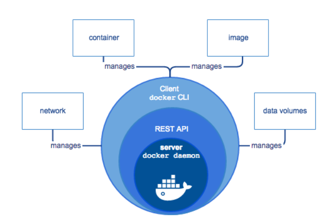
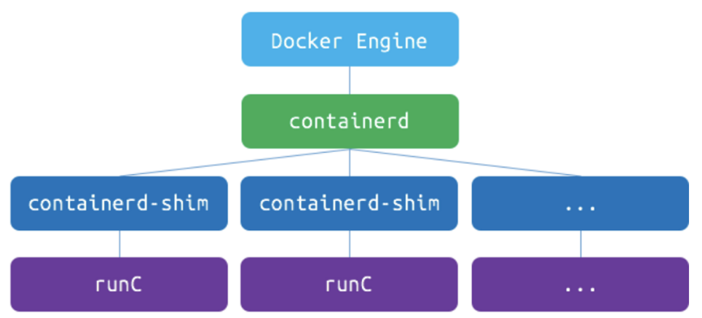
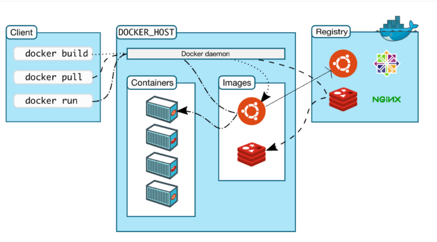
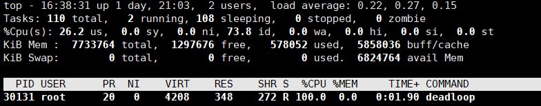

[toc]
#   1. 走进Docker的世界
##  1.1 为什么用Docker
-   提供轻量、高效的虚拟化能力

    Docker 公司位于旧金山,原名dotCloud，底层利用了Linux容器技术（LXC）（在操作系统中实现资源隔离与限制）。为了方便创建和管理这些容器，dotCloud 开发了一套内部工具，之后被命名为“Docker”。Docker就是这样诞生的。

##  1.2 Docker知识点
- 可以把应用程序代码及运行依赖环境打包成镜像，作为交付介质，在各环境部署
- 可以将镜像（image）启动成为容器(container)，并且提供多容器的生命周期进行管理（启、停、删）
- container容器之间相互隔离，且每个容器可以设置资源限额
- 提供轻量级虚拟化功能，容器就是在宿主机中的一个个的虚拟的空间，彼此相互隔离，完全独立。
- CS架构的软件产品


##  1.3 Docker底层原理
- runC（libcontainer）是符合OCI标准的一个实现，与底层系统交互
- containerd是实现了OCI之上的容器的高级功能，比如镜像管理、容器执行的调用等
- Dockerd目前是最上层与CLI交互的进程，接收cli的请求并与containerd协作


##  1.4 Docker搭建
```
## 查看源中可用版本
[root@k8s-master ~]# curl -o /etc/yum.repos.d/Centos-7.repo http://mirrors.aliyun.com/repo/Centos-7.repo
## 查看源中可用版本
[root@k8s-master ~]# curl -o /etc/yum.repos.d/docker-ce.repo http://mirrors.aliyun.com/docker-ce/linux/centos/docker-ce.repo

## 查看源中可用版本
[root@k8s-master ~]# yum list docker-ce --showduplicates | sort -r 
[root@k8s-master ~]# yum clean all && yum makecache     
## yum安装
[root@k8s-master ~]#  yum install docker-ce -y

## 安装指定版本
[root@k8s-master ~]# yum install -y docker-ce-18.09.9

[root@k8s-master ~]# yum list installed |grep docker
containerd.io.x86_64               1.3.7-3.1.el7                  @docker-ce-stable
docker-ce.x86_64                   3:19.03.13-3.el7               @docker-ce-stable
docker-ce-cli.x86_64               1:19.03.13-3.el7               @docker-ce-stable

[root@k8s-master ~]# systemctl daemon-reload
#   查看日志
[root@k8s-master ~]# journalctl -fu docker
```

##  1.5 Docker核心要素


三大核心要素：镜像(Image)、容器(Container)、仓库(Registry)

### 1.5.1 镜像（Image）

打包了业务代码及运行环境的包，是静态的文件，不能直接对外提供服务。

### 1.5.2 容器（Container）

镜像的运行时，可以对外提供服务。

### 1.5.3 仓库（Registry）

存放镜像的地方

- 公有仓库，Docker Hub，阿里，网易...
- 私有仓库，企业内部搭建
  - Docker Registry，Docker官方提供的镜像仓库存储服务
  - Harbor, 是Docker Registry的更高级封装，它除了提供友好的Web UI界面，角色和用户权限管理，用户操作审计等功能 
- 镜像访问地址形式 registry.devops.com/demo/hello:latest,若没有前面的url地址，则默认寻找Docker Hub中的镜像，若没有tag标签，则使用latest作为标签。 比如，docker pull nginx，会被解析成docker.io/library/nginx:latest
- 公有的仓库中，一般存在这么几类镜像
  - 操作系统基础镜像（centos，ubuntu，suse，alpine）
  - 中间件（nginx，redis，mysql，tomcat）
  - 语言编译环境（python，java，golang）
  - 业务镜像（django-demo...）

容器和仓库不会直接交互，都是以镜像为载体来操作。

### 1.5.4   编写DockerFile

- FROM 指定基础镜像，必须为第一个命令

  ```
  格式：
  	FROM <image>
  	FROM <image>:<tag>
  示例：
  	FROM mysql:5.7
  注意：
  	tag是可选的，如果不使用tag时，会使用latest版本的基础镜像
  ```

- MAINTAINER 镜像维护者的信息

  ```
  格式：
  	MAINTAINER <name>
  示例：
  	MAINTAINER Yongxin Li
      MAINTAINER inspur_lyx@hotmail.com
      MAINTAINER Yongxin Li <inspur_lyx@hotmail.com>
  ```

- COPY|ADD 添加本地文件到镜像中

  ```
  格式：
  	COPY <src>... <dest>
  示例：
      ADD hom* /mydir/          # 添加所有以"hom"开头的文件
      ADD test relativeDir/     # 添加 "test" 到 `WORKDIR`/relativeDir/
      ADD test /absoluteDir/    # 添加 "test" 到 /absoluteDir/
  ```

- WORKDIR 工作目录

  ```
  格式：
  	WORKDIR /path/to/workdir
  示例：
      WORKDIR /a  (这时工作目录为/a)
  注意：
  	通过WORKDIR设置工作目录后，Dockerfile中其后的命令RUN、CMD、ENTRYPOINT、ADD、COPY等命令都会在该目录下执行
  ```

- RUN 构建镜像过程中执行命令

  ```
  格式：
  	RUN <command>
  示例：
      RUN yum install nginx
      RUN pip install django
      RUN mkdir test && rm -rf /var/lib/unusedfiles
  注意：
  	RUN指令创建的中间镜像会被缓存，并会在下次构建中使用。如果不想使用这些缓存镜像，可以在构建时指定--no-cache参数，如：docker build --no-cache
  ```

- CMD 构建容器后调用，也就是在容器启动时才进行调用

  ```
  格式：
      CMD ["executable","param1","param2"] (执行可执行文件，优先)
      CMD ["param1","param2"] (设置了ENTRYPOINT，则直接调用ENTRYPOINT添加参数)
      CMD command param1 param2 (执行shell内部命令)
  示例：
      CMD ["/usr/bin/wc","--help"]
      CMD ping www.baidu.com
  注意：
  	CMD不同于RUN，CMD用于指定在容器启动时所要执行的命令，而RUN用于指定镜像构建时所要执行的命令。
  ```

- ENTRYPOINT 设置容器初始化命令，使其可执行化

  ```
  格式：
      ENTRYPOINT ["executable", "param1", "param2"] (可执行文件, 优先)
      ENTRYPOINT command param1 param2 (shell内部命令)
  示例：
      ENTRYPOINT ["/usr/bin/wc","--help"]
  注意：
  	ENTRYPOINT与CMD非常类似，不同的是通过docker run执行的命令不会覆盖ENTRYPOINT，而docker run命令中指定的任何参数，都会被当做参数再次传递给ENTRYPOINT。Dockerfile中只允许有一个ENTRYPOINT命令，多指定时会覆盖前面的设置，而只执行最后的ENTRYPOINT指令
  ```

- ENV

  ```
  格式：
      ENV <key> <value>
      ENV <key>=<value>
  示例：
      ENV myName John
      ENV myCat=fluffy
  ```

- EXPOSE

  ```
  格式：
      EXPOSE <port> [<port>...]
  示例：
      EXPOSE 80 443
      EXPOSE 8080
      EXPOSE 11211/tcp 11211/udp
  注意：
      EXPOSE并不会让容器的端口访问到主机。要使其可访问，需要在docker run运行容器时通过-p来发布这些端口，或通过-P参数来发布EXPOSE导出的所有端口
  
  ```

```
[root@k8s-master ~]# cat Dockerfile 
# 告诉docker使用哪个基础镜像作为模板，后续命令都以这个镜像为基础 
FROM ubuntu
   
# RUN命令会在上面指定的镜像里执行命令 
RUN apt-get update && apt install -y nginx
     
#告诉docker，启动容器时执行如下命令
CMD ["/usr/sbin/nginx", "-g","daemon off;"]
```
### 1.5.5   常用操作 (Operation)
```
#   拉去镜像
docker pull nginx:alpine
#   启动容器
docker run --name my-nginx-alpine -d nginx:alpine
#   分配一个tty终端
docker exec -it 5bf3ab3ffa65 /bin/sh
#   构建镜像
docker build . -t my-nginx:ubuntu -f Dockerfile
#   启动命令
docker exec -it d959628240be /bin/bash
#   搭建registry
docker run -d -p 5000:5000 --restart always --name registry registry:2
#   打tag
docker tag nginx:alpine localhost:5000/nginx:alpine
#   推送镜像
docker push localhost:5000/nginx:alpine
#   查看镜像
[root@k8s-master ~]# curl  -X GET localhost:5000/v2/_catalog
{"repositories":["nginx"]}
[root@k8s-master ~]# curl  -X GET localhost:5000/v2/nginx/tags/list
{"name":"nginx","tags":["alpine"]}
# 资源限制,最大可用内存500M
docker run --memory=500m nginx:alpine
#   数据持久化
docker run --name mysql -e MYSQL_ROOT_PASSWORD=123456 -d -v /opt/mysql/:/var/lib/mysql mysql:5.7
#   容器拷贝
docker cp /tmp/test.txt nginx:/tmp
docker cp nginx:/tmp/test.txt ./
#   查看镜像信息
docker inspect 3afbae21203a -f '{{.GraphDriver.Name}}'
```

### 1.5.6   理解容器本质
-   通过1号进程理解容器的本质

    原则：容器的1号进程不能退出，否则容器会退出
    容器启动的时候可以通过命令去覆盖默认的CMD

### 1.5.7   实践Django使用镜像启动
```
# This my first django Dockerfile
# Version 1.0

# Base images 基础镜像
FROM centos:centos7.5.1804

#MAINTAINER 维护者信息
LABEL maintainer="603611653@qq.com"

#ENV 设置环境变量
ENV LANG en_US.UTF-8
ENV LC_ALL en_US.UTF-8

#RUN 执行以下命令
RUN curl -so /etc/yum.repos.d/Centos-7.repo http://mirrors.aliyun.com/repo/Centos-7.repo && rpm -Uvh http://nginx.org/packages/centos/7/noarch/RPMS/nginx-release-centos-7-0.el7.ngx.noarch.rpm
RUN yum install -y  python36 python3-devel gcc pcre-devel zlib-devel make net-tools nginx

#工作目录
WORKDIR /opt/myblog

#拷贝文件至工作目录
COPY . .

# 拷贝nginx配置文件
COPY myblog.conf /etc/nginx

#安装依赖的插件
RUN pip3 install -i http://mirrors.aliyun.com/pypi/simple/ --trusted-host mirrors.aliyun.com -r requirements.txt

RUN chmod +x run.sh && rm -rf ~/.cache/pip

#EXPOSE 映射端口
EXPOSE 8002

#容器启动时执行命令
CMD ["./run.sh"]
```
-   运行MySQL
```
docker run -d -p 8002:8002 --name myblog -e MYSQL_HOST=192.168.136.10 -e MYSQL_USER=root -e MYSQL_PASSWD=123456  myblog:v1
```
-   启动Django项目
```
 docker run -d -p 8002:8002 --name myblog -e MYSQL_HOST=172.17.176.31 -e MYSQL_USER=root -e MYSQL_PASSWD=123456  myblog:v1
```

##  1.6 实现原理
虚拟化核心需要解决的问题：资源隔离与资源限制

- 虚拟机硬件虚拟化技术， 通过一个 hypervisor 层实现对资源的彻底隔离。
- 容器则是操作系统级别的虚拟化，利用的是内核的 Cgroup 和 Namespace 特性，此功能完全通过软件实现。


###  1.6.1 Namespace 资源隔离
命名空间是全局资源的一种抽象，将资源放到不同的命名空间中，各个命名空间中的资源是相互隔离的。

| **分类**           | **系统调用参数** | **相关内核版本**                                             |
| ------------------ | ---------------- | ------------------------------------------------------------ |
| Mount namespaces   | CLONE_NEWNS      | [Linux 2.4.19](http://lwn.net/2001/0301/a/namespaces.php3)   |
| UTS namespaces     | CLONE_NEWUTS     | [Linux 2.6.19](http://lwn.net/Articles/179345/)              |
| IPC namespaces     | CLONE_NEWIPC     | [Linux 2.6.19](http://lwn.net/Articles/187274/)              |
| PID namespaces     | CLONE_NEWPID     | [Linux 2.6.24](http://lwn.net/Articles/259217/)              |
| Network namespaces | CLONE_NEWNET     | [始于Linux 2.6.24 完成于 Linux 2.6.29](http://lwn.net/Articles/219794/) |
| User namespaces    | CLONE_NEWUSER    | [始于 Linux 2.6.23 完成于 Linux 3.8](http://lwn.net/Articles/528078/) |
```
[root@k8s-master ~]# docker inspect 0a324f31c0b5|grep -i pid
            "Pid": 13049,
            "PidMode": "",
            "PidsLimit": null,
[root@k8s-master ~]# docker inspect 0a324f31c0b5|grep -i pid
            "Pid": 13049,
            "PidMode": "",
            "PidsLimit": null,
[root@k8s-master ~]# ll /proc/$$/ns
total 0
lrwxrwxrwx 1 root root 0 Sep 21 14:43 ipc -> ipc:[4026531839]
lrwxrwxrwx 1 root root 0 Sep 21 14:43 mnt -> mnt:[4026531840]
lrwxrwxrwx 1 root root 0 Sep 21 14:43 net -> net:[4026531956]
lrwxrwxrwx 1 root root 0 Sep 21 14:43 pid -> pid:[4026531836]
lrwxrwxrwx 1 root root 0 Sep 21 14:43 user -> user:[4026531837]
lrwxrwxrwx 1 root root 0 Sep 21 14:43 uts -> uts:[4026531838]
[root@k8s-master ~]# ll /proc/13049/ns
total 0
lrwxrwxrwx 1 root root 0 Sep 20 16:52 ipc -> ipc:[4026532288]
lrwxrwxrwx 1 root root 0 Sep 20 16:52 mnt -> mnt:[4026532286]
lrwxrwxrwx 1 root root 0 Sep 20 16:24 net -> net:[4026532291]
lrwxrwxrwx 1 root root 0 Sep 20 16:52 pid -> pid:[4026532289]
lrwxrwxrwx 1 root root 0 Sep 20 16:53 user -> user:[4026531837]
lrwxrwxrwx 1 root root 0 Sep 20 16:52 uts -> uts:[4026532287]
```
综上：通俗来讲，docker在启动一个容器的时候，会调用Linux Kernel Namespace的接口，来创建一块虚拟空间，创建的时候，可以支持设置下面这几种（可以随意选择）,docker默认都设置。

- pid：用于进程隔离（PID：进程ID）
- net：管理网络接口（NET：网络）
- ipc：管理对 IPC 资源的访问（IPC：进程间通信（信号量、消息队列和共享内存））
- mnt：管理文件系统挂载点（MNT：挂载）
- uts：隔离主机名和域名
- user：隔离用户和用户组


###  1.6.2 CGroup 资源限制
Linux CGroup全称Linux Control Group， 是Linux内核的一个功能，用来限制，控制与分离一个进程组群的资源（如CPU、内存、磁盘输入输出等）。。
主要提供了如下功能：
-   Resource limitation: 限制资源使用，比如内存使用上限以及文件系统的缓存限制。
-   Prioritization: 优先级控制，比如：CPU利用和磁盘IO吞吐。
-   Accounting: 一些审计或一些统计，主要目的是为了计费。
-   Control: 挂起进程，恢复执行进程。
```
[root@k8s-master ~]# mount -t cgroup
cgroup on /sys/fs/cgroup/systemd type cgroup (rw,nosuid,nodev,noexec,relatime,xattr,release_agent=/usr/lib/systemd/systemd-cgroups-agent,name=systemd)
cgroup on /sys/fs/cgroup/memory type cgroup (rw,nosuid,nodev,noexec,relatime,memory)
cgroup on /sys/fs/cgroup/net_cls,net_prio type cgroup (rw,nosuid,nodev,noexec,relatime,net_prio,net_cls)
cgroup on /sys/fs/cgroup/cpu,cpuacct type cgroup (rw,nosuid,nodev,noexec,relatime,cpuacct,cpu)
cgroup on /sys/fs/cgroup/cpuset type cgroup (rw,nosuid,nodev,noexec,relatime,cpuset)
cgroup on /sys/fs/cgroup/blkio type cgroup (rw,nosuid,nodev,noexec,relatime,blkio)
cgroup on /sys/fs/cgroup/hugetlb type cgroup (rw,nosuid,nodev,noexec,relatime,hugetlb)
cgroup on /sys/fs/cgroup/devices type cgroup (rw,nosuid,nodev,noexec,relatime,devices)
cgroup on /sys/fs/cgroup/freezer type cgroup (rw,nosuid,nodev,noexec,relatime,freezer)
cgroup on /sys/fs/cgroup/perf_event type cgroup (rw,nosuid,nodev,noexec,relatime,perf_event)
cgroup on /sys/fs/cgroup/pids type cgroup (rw,nosuid,nodev,noexec,relatime,pids)

[root@k8s-master ~]# ls /sys/fs/cgroup/cpu /sys/fs/cgroup/cpuset/ 
/sys/fs/cgroup/cpu:
cgroup.clone_children  cgroup.sane_behavior  cpuacct.usage_percpu  cpu.rt_period_us   cpu.stat           release_agent  user.slice
cgroup.event_control   cpuacct.stat          cpu.cfs_period_us     cpu.rt_runtime_us  docker             system.slice
cgroup.procs           cpuacct.usage         cpu.cfs_quota_us      cpu.shares         notify_on_release  tasks

/sys/fs/cgroup/cpuset/:
cgroup.clone_children  cpuset.cpus            cpuset.memory_migrate           cpuset.mems                      release_agent
cgroup.event_control   cpuset.effective_cpus  cpuset.memory_pressure          cpuset.sched_load_balance        tasks
cgroup.procs           cpuset.effective_mems  cpuset.memory_pressure_enabled  cpuset.sched_relax_domain_level
cgroup.sane_behavior   cpuset.mem_exclusive   cpuset.memory_spread_page       docker
cpuset.cpu_exclusive   cpuset.mem_hardwall    cpuset.memory_spread_slab       notify_on_release

[root@k8s-master cpu]# mkdir haoel
[root@k8s-master cpu]# ls haoel/
cgroup.clone_children  cgroup.procs  cpuacct.usage         cpu.cfs_period_us  cpu.rt_period_us   cpu.shares  notify_on_release
cgroup.event_control   cpuacct.stat  cpuacct.usage_percpu  cpu.cfs_quota_us   cpu.rt_runtime_us  cpu.stat    tasks
```
-   编写c文件使cpu增高


把该进程加入到我们限制的cgroup
```
[root@k8s-master ~]# cat /sys/fs/cgroup/cpu/haoel/cpu.cfs_quota_us 
[root@k8s-master ~]# cat /sys/fs/cgroup/cpu/haoel/cpu.cfs_quota_us 
-1
[root@k8s-master ~]# echo 20000 > /sys/fs/cgroup/cpu/haoel/cpu.cfs_quota_us
[root@k8s-master ~]# ps -ef|egrep [d]eadloop
root     30131 17478 95 16:38 pts/1    00:03:04 ./deadloop
root     30161 30070  0 16:41 pts/0    00:00:00 grep -E --color=auto deadloop
[root@k8s-master ~]#  echo 30131 >> /sys/fs/cgroup/cpu/haoel/tasks
```
-   再次查看

```
[root@k8s-master ~]# ll /sys/fs/cgroup/
total 0
drwxr-xr-x 5 root root  0 Sep 20 03:34 blkio
lrwxrwxrwx 1 root root 11 Sep 20 03:34 cpu -> cpu,cpuacct
lrwxrwxrwx 1 root root 11 Sep 20 03:34 cpuacct -> cpu,cpuacct
drwxr-xr-x 6 root root  0 Sep 20 03:34 cpu,cpuacct
drwxr-xr-x 3 root root  0 Sep 20 03:34 cpuset
drwxr-xr-x 5 root root  0 Sep 19 19:36 devices
drwxr-xr-x 3 root root  0 Sep 20 03:34 freezer
drwxr-xr-x 3 root root  0 Sep 20 03:34 hugetlb
drwxr-xr-x 5 root root  0 Sep 20 03:34 memory
lrwxrwxrwx 1 root root 16 Sep 20 03:34 net_cls -> net_cls,net_prio
drwxr-xr-x 3 root root  0 Sep 20 03:34 net_cls,net_prio
lrwxrwxrwx 1 root root 16 Sep 20 03:34 net_prio -> net_cls,net_prio
drwxr-xr-x 3 root root  0 Sep 20 03:34 perf_event
drwxr-xr-x 5 root root  0 Sep 20 03:34 pids
drwxr-xr-x 5 root root  0 Sep 20 03:34 systemd
```

```

blkio — 这个子系统为块设备设定输入/输出限制，比如物理设备(磁盘，固态硬盘，USB等等)
cpu — 这个子系统使用调度程序提供对CPU的cgroup 任务访问.
cpuacct — 这个子系统自动生成cgroup中任务所使用的CPU报告.
cpuset — 这个子系统为cgroup中的任务分配独立 CPU（在多核系统）和内存节点
devices — 这个子系统可允许或者拒绝cgroup 中的任务访问设备.
freezer — 这个子系统挂起或者恢复cgroup 中的任务.
memory — 这个子系统设定cgroup 中任务使用的内存限制，并自动生成内存资源使用报告.
net_cls — 这个子系统使用等级识别符（classid）标记网络数据包可允许Linux 流量控制程序（tc）识别从具体 cgroup 中生成的数据包。
net_prio — 这个子系统用来设计网络流量的优先级
hugetlb — 这个子系统主要针对于HugeTLB系统进行限制，这是一个大页文件系统。
```

### 1.6.3 UnionFS 联合文件系统
UnionFS就是把不同物理位置的目录合并mount到同一个目录中。UnionFS的一个最主要的应用是，把一张CD/DVD和一个硬盘目录给联合 mount在一起，然后，你就可以对这个只读的CD/DVD上的文件进行修改（当然，修改的文件存于硬盘上的目录里）。
UnionFS就是把不同物理位置的目录合并mount到同一个目录中。UnionFS的一个最主要的应用是，把一张CD/DVD和一个硬盘目录给联合 mount在一起，然后，你就可以对这个只读的CD/DVD上的文件进行修改（当然，修改的文件存于硬盘上的目录里）。


#  2. Docker网络
docker容器是一块具有隔离性的虚拟系统，容器内可以有自己独立的网络空间
- 多个容器之间是如何实现通信的呢
- 容器和宿主机之间又是如何实现的通信呢
- 使用-p参数是怎么实现的端口映射


