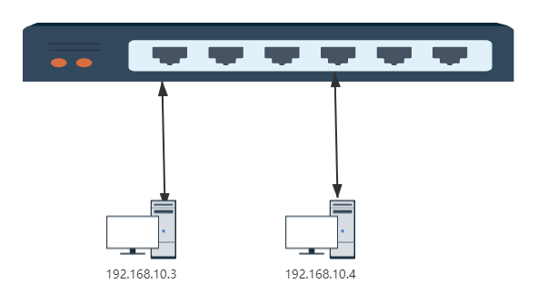

- [1. 走进Docker的世界](#1---docker---)
  * [1.1 为什么用Docker](#11-----docker)
  * [1.2 Docker知识点](#12-docker---)
  * [1.3 Docker底层原理](#13-docker----)
  * [1.4 Docker搭建](#14-docker--)
  * [1.5 Docker核心要素](#15-docker----)
    + [1.5.1 镜像（Image）](#151----image-)
    + [1.5.2 容器（Container）](#152----container-)
    + [1.5.3 仓库（Registry）](#153----registry-)
    + [1.5.4   编写DockerFile](#154-----dockerfile)
    + [1.5.5   常用操作 (Operation)](#155---------operation-)
    + [1.5.6   理解容器本质](#156---------)
    + [1.5.7   实践Django使用镜像启动](#157-----django------)
  * [1.6 实现原理](#16-----)
    + [1.6.1 Namespace 资源隔离](#161-namespace-----)
    + [1.6.2 CGroup 资源限制](#162-cgroup-----)
    + [1.6.3 UnionFS 联合文件系统](#163-unionfs-------)
- [2. Docker网络](#2-docker--)
  * [2.1 bridge模式](#21-bridge--)
    + [2.1.1 清空所有容器](#211-------)
    + [2.1.2   创建测试容器test1,test2](#212---------test1-test2)
    + [2.1.3   为什么能通信](#213---------)
  * [2.2 Host模式](#22-host--)
  * [2.3 Conatiner模式](#23-conatiner--)
  * [2.4 None模式](#2.4-none--)
  
#   1. 走进Docker的世界
##  1.1 为什么用Docker
-   提供轻量、高效的虚拟化能力

    Docker 公司位于旧金山,原名dotCloud，底层利用了Linux容器技术（LXC）（在操作系统中实现资源隔离与限制）。为了方便创建和管理这些容器，dotCloud 开发了一套内部工具，之后被命名为“Docker”。Docker就是这样诞生的。

##  1.2 Docker知识点
- 可以把应用程序代码及运行依赖环境打包成镜像，作为交付介质，在各环境部署
- 可以将镜像（image）启动成为容器(container)，并且提供多容器的生命周期进行管理（启、停、删）
- container容器之间相互隔离，且每个容器可以设置资源限额
- 提供轻量级虚拟化功能，容器就是在宿主机中的一个个的虚拟的空间，彼此相互隔离，完全独立。
- CS架构的软件产品


##  1.3 Docker底层原理
- runC（libcontainer）是符合OCI标准的一个实现，与底层系统交互
- containerd是实现了OCI之上的容器的高级功能，比如镜像管理、容器执行的调用等
- Dockerd目前是最上层与CLI交互的进程，接收cli的请求并与containerd协作


##  1.4 Docker搭建
```
## 查看源中可用版本
[root@k8s-master ~]# curl -o /etc/yum.repos.d/Centos-7.repo http://mirrors.aliyun.com/repo/Centos-7.repo
## 查看源中可用版本
[root@k8s-master ~]# curl -o /etc/yum.repos.d/docker-ce.repo http://mirrors.aliyun.com/docker-ce/linux/centos/docker-ce.repo

## 查看源中可用版本
[root@k8s-master ~]# yum list docker-ce --showduplicates | sort -r 
[root@k8s-master ~]# yum clean all && yum makecache     
## yum安装
[root@k8s-master ~]#  yum install docker-ce -y

## 安装指定版本
[root@k8s-master ~]# yum install -y docker-ce-18.09.9

[root@k8s-master ~]# yum list installed |grep docker
containerd.io.x86_64               1.3.7-3.1.el7                  @docker-ce-stable
docker-ce.x86_64                   3:19.03.13-3.el7               @docker-ce-stable
docker-ce-cli.x86_64               1:19.03.13-3.el7               @docker-ce-stable

[root@k8s-master ~]# systemctl daemon-reload
#   查看日志
[root@k8s-master ~]# journalctl -fu docker
```

##  1.5 Docker核心要素


三大核心要素：镜像(Image)、容器(Container)、仓库(Registry)

### 1.5.1 镜像（Image）

打包了业务代码及运行环境的包，是静态的文件，不能直接对外提供服务。

### 1.5.2 容器（Container）

镜像的运行时，可以对外提供服务。

### 1.5.3 仓库（Registry）

存放镜像的地方

- 公有仓库，Docker Hub，阿里，网易...
- 私有仓库，企业内部搭建
  - Docker Registry，Docker官方提供的镜像仓库存储服务
  - Harbor, 是Docker Registry的更高级封装，它除了提供友好的Web UI界面，角色和用户权限管理，用户操作审计等功能 
- 镜像访问地址形式 registry.devops.com/demo/hello:latest,若没有前面的url地址，则默认寻找Docker Hub中的镜像，若没有tag标签，则使用latest作为标签。 比如，docker pull nginx，会被解析成docker.io/library/nginx:latest
- 公有的仓库中，一般存在这么几类镜像
  - 操作系统基础镜像（centos，ubuntu，suse，alpine）
  - 中间件（nginx，redis，mysql，tomcat）
  - 语言编译环境（python，java，golang）
  - 业务镜像（django-demo...）

容器和仓库不会直接交互，都是以镜像为载体来操作。

### 1.5.4   编写DockerFile

- FROM 指定基础镜像，必须为第一个命令

  ```
  格式：
  	FROM <image>
  	FROM <image>:<tag>
  示例：
  	FROM mysql:5.7
  注意：
  	tag是可选的，如果不使用tag时，会使用latest版本的基础镜像
  ```

- MAINTAINER 镜像维护者的信息

  ```
  格式：
  	MAINTAINER <name>
  示例：
  	MAINTAINER Yongxin Li
      MAINTAINER inspur_lyx@hotmail.com
      MAINTAINER Yongxin Li <inspur_lyx@hotmail.com>
  ```

- COPY|ADD 添加本地文件到镜像中

  ```
  格式：
  	COPY <src>... <dest>
  示例：
      ADD hom* /mydir/          # 添加所有以"hom"开头的文件
      ADD test relativeDir/     # 添加 "test" 到 `WORKDIR`/relativeDir/
      ADD test /absoluteDir/    # 添加 "test" 到 /absoluteDir/
  ```

- WORKDIR 工作目录

  ```
  格式：
  	WORKDIR /path/to/workdir
  示例：
      WORKDIR /a  (这时工作目录为/a)
  注意：
  	通过WORKDIR设置工作目录后，Dockerfile中其后的命令RUN、CMD、ENTRYPOINT、ADD、COPY等命令都会在该目录下执行
  ```

- RUN 构建镜像过程中执行命令

  ```
  格式：
  	RUN <command>
  示例：
      RUN yum install nginx
      RUN pip install django
      RUN mkdir test && rm -rf /var/lib/unusedfiles
  注意：
  	RUN指令创建的中间镜像会被缓存，并会在下次构建中使用。如果不想使用这些缓存镜像，可以在构建时指定--no-cache参数，如：docker build --no-cache
  ```

- CMD 构建容器后调用，也就是在容器启动时才进行调用

  ```
  格式：
      CMD ["executable","param1","param2"] (执行可执行文件，优先)
      CMD ["param1","param2"] (设置了ENTRYPOINT，则直接调用ENTRYPOINT添加参数)
      CMD command param1 param2 (执行shell内部命令)
  示例：
      CMD ["/usr/bin/wc","--help"]
      CMD ping www.baidu.com
  注意：
  	CMD不同于RUN，CMD用于指定在容器启动时所要执行的命令，而RUN用于指定镜像构建时所要执行的命令。
  ```

- ENTRYPOINT 设置容器初始化命令，使其可执行化

  ```
  格式：
      ENTRYPOINT ["executable", "param1", "param2"] (可执行文件, 优先)
      ENTRYPOINT command param1 param2 (shell内部命令)
  示例：
      ENTRYPOINT ["/usr/bin/wc","--help"]
  注意：
  	ENTRYPOINT与CMD非常类似，不同的是通过docker run执行的命令不会覆盖ENTRYPOINT，而docker run命令中指定的任何参数，都会被当做参数再次传递给ENTRYPOINT。Dockerfile中只允许有一个ENTRYPOINT命令，多指定时会覆盖前面的设置，而只执行最后的ENTRYPOINT指令
  ```

- ENV

  ```
  格式：
      ENV <key> <value>
      ENV <key>=<value>
  示例：
      ENV myName John
      ENV myCat=fluffy
  ```

- EXPOSE

  ```
  格式：
      EXPOSE <port> [<port>...]
  示例：
      EXPOSE 80 443
      EXPOSE 8080
      EXPOSE 11211/tcp 11211/udp
  注意：
      EXPOSE并不会让容器的端口访问到主机。要使其可访问，需要在docker run运行容器时通过-p来发布这些端口，或通过-P参数来发布EXPOSE导出的所有端口
  
  ```

```
[root@k8s-master ~]# cat Dockerfile 
# 告诉docker使用哪个基础镜像作为模板，后续命令都以这个镜像为基础 
FROM ubuntu
   
# RUN命令会在上面指定的镜像里执行命令 
RUN apt-get update && apt install -y nginx
     
#告诉docker，启动容器时执行如下命令
CMD ["/usr/sbin/nginx", "-g","daemon off;"]
```
### 1.5.5   常用操作 (Operation)
```
#   拉去镜像
docker pull nginx:alpine
#   启动容器
docker run --name my-nginx-alpine -d nginx:alpine
#   分配一个tty终端
docker exec -it 5bf3ab3ffa65 /bin/sh
#   构建镜像
docker build . -t my-nginx:ubuntu -f Dockerfile
#   启动命令
docker exec -it d959628240be /bin/bash
#   搭建registry
docker run -d -p 5000:5000 --restart always --name registry registry:2
#   打tag
docker tag nginx:alpine localhost:5000/nginx:alpine
#   推送镜像
docker push localhost:5000/nginx:alpine
#   查看镜像
[root@k8s-master ~]# curl  -X GET localhost:5000/v2/_catalog
{"repositories":["nginx"]}
[root@k8s-master ~]# curl  -X GET localhost:5000/v2/nginx/tags/list
{"name":"nginx","tags":["alpine"]}
# 资源限制,最大可用内存500M
docker run --memory=500m nginx:alpine
#   数据持久化
docker run --name mysql -e MYSQL_ROOT_PASSWORD=123456 -d -v /opt/mysql/:/var/lib/mysql mysql:5.7
#   容器拷贝
docker cp /tmp/test.txt nginx:/tmp
docker cp nginx:/tmp/test.txt ./
#   查看镜像信息
docker inspect 3afbae21203a -f '{{.GraphDriver.Name}}'
```

### 1.5.6   理解容器本质
-   通过1号进程理解容器的本质

    原则：容器的1号进程不能退出，否则容器会退出
    容器启动的时候可以通过命令去覆盖默认的CMD

### 1.5.7   实践Django使用镜像启动
```
# This my first django Dockerfile
# Version 1.0

# Base images 基础镜像
FROM centos:centos7.5.1804

#MAINTAINER 维护者信息
LABEL maintainer="603611653@qq.com"

#ENV 设置环境变量
ENV LANG en_US.UTF-8
ENV LC_ALL en_US.UTF-8

#RUN 执行以下命令
RUN curl -so /etc/yum.repos.d/Centos-7.repo http://mirrors.aliyun.com/repo/Centos-7.repo && rpm -Uvh http://nginx.org/packages/centos/7/noarch/RPMS/nginx-release-centos-7-0.el7.ngx.noarch.rpm
RUN yum install -y  python36 python3-devel gcc pcre-devel zlib-devel make net-tools nginx

#工作目录
WORKDIR /opt/myblog

#拷贝文件至工作目录
COPY . .

# 拷贝nginx配置文件
COPY myblog.conf /etc/nginx

#安装依赖的插件
RUN pip3 install -i http://mirrors.aliyun.com/pypi/simple/ --trusted-host mirrors.aliyun.com -r requirements.txt

RUN chmod +x run.sh && rm -rf ~/.cache/pip

#EXPOSE 映射端口
EXPOSE 8002

#容器启动时执行命令
CMD ["./run.sh"]
```
-   运行MySQL
```
docker run -d -p 8002:8002 --name myblog -e MYSQL_HOST=192.168.136.10 -e MYSQL_USER=root -e MYSQL_PASSWD=123456  myblog:v1
```
-   启动Django项目
```
 docker run -d -p 8002:8002 --name myblog -e MYSQL_HOST=172.17.176.31 -e MYSQL_USER=root -e MYSQL_PASSWD=123456  myblog:v1
```

##  1.6 实现原理
虚拟化核心需要解决的问题：资源隔离与资源限制

- 虚拟机硬件虚拟化技术， 通过一个 hypervisor 层实现对资源的彻底隔离。
- 容器则是操作系统级别的虚拟化，利用的是内核的 Cgroup 和 Namespace 特性，此功能完全通过软件实现。


###  1.6.1 Namespace 资源隔离
命名空间是全局资源的一种抽象，将资源放到不同的命名空间中，各个命名空间中的资源是相互隔离的。

| **分类**           | **系统调用参数** | **相关内核版本**                                             |
| ------------------ | ---------------- | ------------------------------------------------------------ |
| Mount namespaces   | CLONE_NEWNS      | [Linux 2.4.19](http://lwn.net/2001/0301/a/namespaces.php3)   |
| UTS namespaces     | CLONE_NEWUTS     | [Linux 2.6.19](http://lwn.net/Articles/179345/)              |
| IPC namespaces     | CLONE_NEWIPC     | [Linux 2.6.19](http://lwn.net/Articles/187274/)              |
| PID namespaces     | CLONE_NEWPID     | [Linux 2.6.24](http://lwn.net/Articles/259217/)              |
| Network namespaces | CLONE_NEWNET     | [始于Linux 2.6.24 完成于 Linux 2.6.29](http://lwn.net/Articles/219794/) |
| User namespaces    | CLONE_NEWUSER    | [始于 Linux 2.6.23 完成于 Linux 3.8](http://lwn.net/Articles/528078/) |
```
[root@k8s-master ~]# docker inspect 0a324f31c0b5|grep -i pid
            "Pid": 13049,
            "PidMode": "",
            "PidsLimit": null,
[root@k8s-master ~]# docker inspect 0a324f31c0b5|grep -i pid
            "Pid": 13049,
            "PidMode": "",
            "PidsLimit": null,
[root@k8s-master ~]# ll /proc/$$/ns
total 0
lrwxrwxrwx 1 root root 0 Sep 21 14:43 ipc -> ipc:[4026531839]
lrwxrwxrwx 1 root root 0 Sep 21 14:43 mnt -> mnt:[4026531840]
lrwxrwxrwx 1 root root 0 Sep 21 14:43 net -> net:[4026531956]
lrwxrwxrwx 1 root root 0 Sep 21 14:43 pid -> pid:[4026531836]
lrwxrwxrwx 1 root root 0 Sep 21 14:43 user -> user:[4026531837]
lrwxrwxrwx 1 root root 0 Sep 21 14:43 uts -> uts:[4026531838]
[root@k8s-master ~]# ll /proc/13049/ns
total 0
lrwxrwxrwx 1 root root 0 Sep 20 16:52 ipc -> ipc:[4026532288]
lrwxrwxrwx 1 root root 0 Sep 20 16:52 mnt -> mnt:[4026532286]
lrwxrwxrwx 1 root root 0 Sep 20 16:24 net -> net:[4026532291]
lrwxrwxrwx 1 root root 0 Sep 20 16:52 pid -> pid:[4026532289]
lrwxrwxrwx 1 root root 0 Sep 20 16:53 user -> user:[4026531837]
lrwxrwxrwx 1 root root 0 Sep 20 16:52 uts -> uts:[4026532287]
```
综上：通俗来讲，docker在启动一个容器的时候，会调用Linux Kernel Namespace的接口，来创建一块虚拟空间，创建的时候，可以支持设置下面这几种（可以随意选择）,docker默认都设置。

- pid：用于进程隔离（PID：进程ID）
- net：管理网络接口（NET：网络）
- ipc：管理对 IPC 资源的访问（IPC：进程间通信（信号量、消息队列和共享内存））
- mnt：管理文件系统挂载点（MNT：挂载）
- uts：隔离主机名和域名
- user：隔离用户和用户组


###  1.6.2 CGroup 资源限制
Linux CGroup全称Linux Control Group， 是Linux内核的一个功能，用来限制，控制与分离一个进程组群的资源（如CPU、内存、磁盘输入输出等）。。
主要提供了如下功能：
-   Resource limitation: 限制资源使用，比如内存使用上限以及文件系统的缓存限制。
-   Prioritization: 优先级控制，比如：CPU利用和磁盘IO吞吐。
-   Accounting: 一些审计或一些统计，主要目的是为了计费。
-   Control: 挂起进程，恢复执行进程。
```
[root@k8s-master ~]# mount -t cgroup
cgroup on /sys/fs/cgroup/systemd type cgroup (rw,nosuid,nodev,noexec,relatime,xattr,release_agent=/usr/lib/systemd/systemd-cgroups-agent,name=systemd)
cgroup on /sys/fs/cgroup/memory type cgroup (rw,nosuid,nodev,noexec,relatime,memory)
cgroup on /sys/fs/cgroup/net_cls,net_prio type cgroup (rw,nosuid,nodev,noexec,relatime,net_prio,net_cls)
cgroup on /sys/fs/cgroup/cpu,cpuacct type cgroup (rw,nosuid,nodev,noexec,relatime,cpuacct,cpu)
cgroup on /sys/fs/cgroup/cpuset type cgroup (rw,nosuid,nodev,noexec,relatime,cpuset)
cgroup on /sys/fs/cgroup/blkio type cgroup (rw,nosuid,nodev,noexec,relatime,blkio)
cgroup on /sys/fs/cgroup/hugetlb type cgroup (rw,nosuid,nodev,noexec,relatime,hugetlb)
cgroup on /sys/fs/cgroup/devices type cgroup (rw,nosuid,nodev,noexec,relatime,devices)
cgroup on /sys/fs/cgroup/freezer type cgroup (rw,nosuid,nodev,noexec,relatime,freezer)
cgroup on /sys/fs/cgroup/perf_event type cgroup (rw,nosuid,nodev,noexec,relatime,perf_event)
cgroup on /sys/fs/cgroup/pids type cgroup (rw,nosuid,nodev,noexec,relatime,pids)

[root@k8s-master ~]# ls /sys/fs/cgroup/cpu /sys/fs/cgroup/cpuset/ 
/sys/fs/cgroup/cpu:
cgroup.clone_children  cgroup.sane_behavior  cpuacct.usage_percpu  cpu.rt_period_us   cpu.stat           release_agent  user.slice
cgroup.event_control   cpuacct.stat          cpu.cfs_period_us     cpu.rt_runtime_us  docker             system.slice
cgroup.procs           cpuacct.usage         cpu.cfs_quota_us      cpu.shares         notify_on_release  tasks

/sys/fs/cgroup/cpuset/:
cgroup.clone_children  cpuset.cpus            cpuset.memory_migrate           cpuset.mems                      release_agent
cgroup.event_control   cpuset.effective_cpus  cpuset.memory_pressure          cpuset.sched_load_balance        tasks
cgroup.procs           cpuset.effective_mems  cpuset.memory_pressure_enabled  cpuset.sched_relax_domain_level
cgroup.sane_behavior   cpuset.mem_exclusive   cpuset.memory_spread_page       docker
cpuset.cpu_exclusive   cpuset.mem_hardwall    cpuset.memory_spread_slab       notify_on_release

[root@k8s-master cpu]# mkdir haoel
[root@k8s-master cpu]# ls haoel/
cgroup.clone_children  cgroup.procs  cpuacct.usage         cpu.cfs_period_us  cpu.rt_period_us   cpu.shares  notify_on_release
cgroup.event_control   cpuacct.stat  cpuacct.usage_percpu  cpu.cfs_quota_us   cpu.rt_runtime_us  cpu.stat    tasks
```
-   编写c文件使cpu增高


把该进程加入到我们限制的cgroup
```
[root@k8s-master ~]# cat /sys/fs/cgroup/cpu/haoel/cpu.cfs_quota_us 
[root@k8s-master ~]# cat /sys/fs/cgroup/cpu/haoel/cpu.cfs_quota_us 
-1
[root@k8s-master ~]# echo 20000 > /sys/fs/cgroup/cpu/haoel/cpu.cfs_quota_us
[root@k8s-master ~]# ps -ef|egrep [d]eadloop
root     30131 17478 95 16:38 pts/1    00:03:04 ./deadloop
root     30161 30070  0 16:41 pts/0    00:00:00 grep -E --color=auto deadloop
[root@k8s-master ~]#  echo 30131 >> /sys/fs/cgroup/cpu/haoel/tasks
```
-   再次查看

```
[root@k8s-master ~]# ll /sys/fs/cgroup/
total 0
drwxr-xr-x 5 root root  0 Sep 20 03:34 blkio
lrwxrwxrwx 1 root root 11 Sep 20 03:34 cpu -> cpu,cpuacct
lrwxrwxrwx 1 root root 11 Sep 20 03:34 cpuacct -> cpu,cpuacct
drwxr-xr-x 6 root root  0 Sep 20 03:34 cpu,cpuacct
drwxr-xr-x 3 root root  0 Sep 20 03:34 cpuset
drwxr-xr-x 5 root root  0 Sep 19 19:36 devices
drwxr-xr-x 3 root root  0 Sep 20 03:34 freezer
drwxr-xr-x 3 root root  0 Sep 20 03:34 hugetlb
drwxr-xr-x 5 root root  0 Sep 20 03:34 memory
lrwxrwxrwx 1 root root 16 Sep 20 03:34 net_cls -> net_cls,net_prio
drwxr-xr-x 3 root root  0 Sep 20 03:34 net_cls,net_prio
lrwxrwxrwx 1 root root 16 Sep 20 03:34 net_prio -> net_cls,net_prio
drwxr-xr-x 3 root root  0 Sep 20 03:34 perf_event
drwxr-xr-x 5 root root  0 Sep 20 03:34 pids
drwxr-xr-x 5 root root  0 Sep 20 03:34 systemd
```

```

blkio — 这个子系统为块设备设定输入/输出限制，比如物理设备(磁盘，固态硬盘，USB等等)
cpu — 这个子系统使用调度程序提供对CPU的cgroup 任务访问.
cpuacct — 这个子系统自动生成cgroup中任务所使用的CPU报告.
cpuset — 这个子系统为cgroup中的任务分配独立 CPU（在多核系统）和内存节点
devices — 这个子系统可允许或者拒绝cgroup 中的任务访问设备.
freezer — 这个子系统挂起或者恢复cgroup 中的任务.
memory — 这个子系统设定cgroup 中任务使用的内存限制，并自动生成内存资源使用报告.
net_cls — 这个子系统使用等级识别符（classid）标记网络数据包可允许Linux 流量控制程序（tc）识别从具体 cgroup 中生成的数据包。
net_prio — 这个子系统用来设计网络流量的优先级
hugetlb — 这个子系统主要针对于HugeTLB系统进行限制，这是一个大页文件系统。
```

### 1.6.3 UnionFS 联合文件系统
UnionFS就是把不同物理位置的目录合并mount到同一个目录中。UnionFS的一个最主要的应用是，把一张CD/DVD和一个硬盘目录给联合 mount在一起，然后，你就可以对这个只读的CD/DVD上的文件进行修改（当然，修改的文件存于硬盘上的目录里）。
UnionFS就是把不同物理位置的目录合并mount到同一个目录中。UnionFS的一个最主要的应用是，把一张CD/DVD和一个硬盘目录给联合 mount在一起，然后，你就可以对这个只读的CD/DVD上的文件进行修改（当然，修改的文件存于硬盘上的目录里）。


#  2. Docker网络
docker容器是一块具有隔离性的虚拟系统，容器内可以有自己独立的网络空间
- 多个容器之间是如何实现通信的呢
- 容器和宿主机之间又是如何实现的通信呢
- 使用-p参数是怎么实现的端口映射

我们在使用docker run创建Docker容器时，可以用--net选项指定容器的网络模式，Docker有以下4种网络模式：

- bridge模式，使用--net=bridge指定，默认设置

- host模式，使用--net=host指定，容器内部网络空间共享宿主机的空间，效果类似直接在宿主机上启动一个进程，端口信息和宿主机共用

- container模式，使用--net=container:NAME_or_ID指定

  指定容器与特定容器共享网络命名空间

- none模式，使用--net=none指定

##  2.1 bridge模式
-   交换机通信简图



-   网桥模式示意图


-   Linux查看网桥操作
```
[root@k8s-master ~]# yum install -y bridge-utils
[root@k8s-master ~]# brctl show
bridge name	bridge id		STP enabled	interfaces
docker0		8000.02428c27984c	no		veth0db5e12
							veth8369b2f
							vethb632024
```

Docker 创建一个容器的时候，会执行如下操作：
- 创建一对虚拟接口/网卡，也就是veth pair；
- 本地主机一端桥接 到默认的 docker0 或指定网桥上，并具有一个唯一的名字，如 veth0db5e12；
- 容器一端放到新启动的容器内部，并修改名字作为 eth0，这个网卡/接口只在容器的命名空间可见；
- 从网桥可用地址段中（也就是与该bridge对应的network）获取一个空闲地址分配给容器的 eth0
- 配置默认路由到网桥

那整个过程其实是docker自动帮我们完成的，清理掉所有容器，来验证。

### 2.1.1 清空所有容器
```
[root@k8s-master ~]# docker rm -f `docker ps -aq`
0a324f31c0b5
a390ccb80440
3afbae21203a
[root@k8s-master ~]# docker ps
CONTAINER ID        IMAGE               COMMAND             CREATED             STATUS              PORTS               NAMES
[root@k8s-master ~]# brctl show
bridge name	bridge id		STP enabled	interfaces
docker0		8000.02428c27984c	no

```
### 2.1.2   创建测试容器test1,test2
```
[root@k8s-master ~]# docker run -d --name test1 nginx:alpine
06a4b2969427cdb76a88532d6985adb172a00ba148bc1f02ea0bd0d31a9a1d34
[root@k8s-master ~]# brctl show
bridge name	bridge id		STP enabled	interfaces
docker0		8000.02428c27984c	no		veth32652ea
[root@k8s-master ~]# ip a |grep veth
49: veth32652ea@if48: <BROADCAST,MULTICAST,UP,LOWER_UP> mtu 1500 qdisc noqueue master docker0 state UP group default
[root@k8s-master ~]# docker exec -ti test1 ifconfig
eth0      Link encap:Ethernet  HWaddr 02:42:AC:12:00:02
          inet addr:172.18.0.2  Bcast:172.18.255.255  Mask:255.255.0.0
          UP BROADCAST RUNNING MULTICAST  MTU:1500  Metric:1
          RX packets:0 errors:0 dropped:0 overruns:0 frame:0
          TX packets:0 errors:0 dropped:0 overruns:0 carrier:0
          collisions:0 txqueuelen:0
          RX bytes:0 (0.0 B)  TX bytes:0 (0.0 B)

lo        Link encap:Local Loopback
          inet addr:127.0.0.1  Mask:255.0.0.0
          UP LOOPBACK RUNNING  MTU:65536  Metric:1
          RX packets:0 errors:0 dropped:0 overruns:0 frame:0
          TX packets:0 errors:0 dropped:0 overruns:0 carrier:0
          collisions:0 txqueuelen:1000
          RX bytes:0 (0.0 B)  TX bytes:0 (0.0 B)

### 创建test2容器
[root@k8s-master ~]# docker run -d --name test2 nginx:alpine
5935aac86adbdd6f0b8413adff409156bd8af6673910f644d1badf623c12fe2b
[root@k8s-master ~]# docker exec -ti test2 sh
/ # sed -i 's/dl-cdn.alpinelinux.org/mirrors.tuna.tsinghua.edu.cn/g' /etc/apk/repositories
/ # apk add curl
fetch http://mirrors.tuna.tsinghua.edu.cn/alpine/v3.12/main/x86_64/APKINDEX.tar.gz
fetch http://mirrors.tuna.tsinghua.edu.cn/alpine/v3.12/community/x86_64/APKINDEX.tar.gz
/ # curl  172.18.0.2
```
### 2.1.3   为什么能通信
```
/ # route -n
Kernel IP routing table
Destination     Gateway         Genmask         Flags Metric Ref    Use Iface
0.0.0.0         172.18.0.1      0.0.0.0         UG    0      0        0 eth0
172.18.0.0      0.0.0.0         255.255.0.0     U     0      0        0 eth0
```
-   eth0 网卡是这个容器里的默认路由设备；所有对 172.18.0.0/16 网段的请求，也会被交给 eth0 来处理（第二条 172.18.0.0 路由规则），这条路由规则的网关（Gateway）是 0.0.0.0，这就意味着这是一条直连规则，即：凡是匹配到这条规则的 IP 包，应该经过本机的 eth0 网卡，通过二层网络(数据链路层)直接发往目的主机。

-    而要通过二层网络到达 test1 容器，就需要有 172.18.0.2 这个 IP 地址对应的 MAC 地址。所以test2容器的网络协议栈，就需要通过 eth0 网卡发送一个 ARP 广播，来通过 IP 地址查找对应的 MAC 地址。

-   这个 eth0 网卡，是一个 Veth Pair，它的一端在这个 test2 容器的 Network Namespace 里，而另一端则位于宿主机上（Host Namespace），并且被“插”在了宿主机的 docker0 网桥上。网桥设备的一个特点是插在桥上的网卡都会被当成桥上的一个端口来处理，而端口的唯一作用就是接收流入的数据包，然后把这些数据包的“生杀大权”（比如转发或者丢弃），全部交给对应的网桥设备处理。

-   因此ARP的广播请求也会由docker0来负责转发，这样网桥就维护了一份端口与mac的信息表，因此针对test2的eth0拿到mac地址后发出的各类请求，同样走到docker0网桥中由网桥负责转发到对应的容器中。

-   网桥会维护一份mac映射表，我们可以大概通过命令来看一下

```
[root@k8s-master ~]# brctl showmacs docker0
port no	mac addr		is local?	ageing timer
  2	72:b5:69:87:9c:20	yes		   0.00
  2	72:b5:69:87:9c:20	yes		   0.00
  1	f2:da:d9:3d:99:4a	yes		   0.00
  1	f2:da:d9:3d:99:4a	yes		   0.00
```
我们如何知道网桥上的这些虚拟网卡与容器端是如何对应？

通过ifindex，网卡索引号
```
[root@k8s-master ~]# docker exec -it test1 cat /sys/class/net/eth0/ifindex
48
[root@k8s-master ~]# ip a|grep @if
49: veth32652ea@if48: <BROADCAST,MULTICAST,UP,LOWER_UP> mtu 1500 qdisc noqueue master docker0 state UP group default
51: veth96900b0@if50: <BROADCAST,MULTICAST,UP,LOWER_UP> mtu 1500 qdisc noqueue master docker0 state UP group default
```
整理脚本，快速查看对应：
```
for container in $(docker ps -q); do
    iflink=`docker exec -it $container sh -c 'cat /sys/class/net/eth0/iflink'`
    iflink=`echo $iflink|tr -d '\r'`
    veth=`grep -l $iflink /sys/class/net/veth*/ifindex`
    veth=`echo $veth|sed -e 's;^.*net/\(.*\)/ifindex$;\1;'`
    echo $container:$veth
done
```
-   端口是如何映射的

数据包入方向
```
[root@k8s-master ~]# docker run --name test -d -p 8088:80 nginx:alpine
a8e3fcb01f953dd8ec9fd41edb23c92d5b15575a86776a830d57bcd8e2404239
[root@k8s-master ~]# curl localhost:8088
```

```
#   访问本机的8088端口，数据包会从流入方向进入本机，因此涉及到PREROUTING和INPUT链，我们是通过做宿主机与容器之间加的端口映射，所以肯定会涉及到端口转换，那哪个表是负责存储端口转换信息的呢，就是nat表，负责维护网络地址转换信息的。因此我们来查看一下PREROUTING链的nat表：

[root@k8s-master ~]# iptables -t nat -nvL PREROUTING
Chain PREROUTING (policy ACCEPT 3 packets, 212 bytes)
 pkts bytes target     prot opt in     out     source               destination
  761 38840 DOCKER     all  --  *      *       0.0.0.0/0            0.0.0.0/0            ADDRTYPE match dst-type LOCAL

#   规则利用了iptables的addrtype拓展，匹配网络类型为本地的包，如何确定哪些是匹配本地，
[root@k8s-master ~]# ip route show table local type local
local 127.0.0.0/8 dev lo proto kernel scope host src 127.0.0.1
local 127.0.0.1 dev lo proto kernel scope host src 127.0.0.1
local 172.17.176.31 dev eth0 proto kernel scope host src 172.17.176.31
local 172.18.0.1 dev docker0 proto kernel scope host src 172.18.0.1

#也就是说目标地址类型匹配到这些的，会转发到我们的TARGET中，TARGET是动作，意味着对符合要求的数据包执行什么样的操作，最常见的为ACCEPT或者DROP，此处的TARGET为DOCKER，很明显DOCKER不是标准的动作，那DOCKER是什么呢？我们通常会定义自定义的链，这样把某类对应的规则放在自定义链中，然后把自定义的链绑定到标准的链路中，因此此处DOCKER


[root@k8s-master ~]# iptables -t nat -nvL DOCKER
Chain DOCKER (2 references)
 pkts bytes target     prot opt in     out     source               destination
   27  1620 RETURN     all  --  docker0 *       0.0.0.0/0            0.0.0.0/0
    0     0 DNAT       tcp  --  !docker0 *       0.0.0.0/0            0.0.0.0/0            tcp dpt:8088 to:172.18.0.4:80

#   此条规则就是对主机收到的目的端口为8088的tcp流量进行DNAT转换，将流量发往172.18.0.4:80，172.18.0.4地址是不是就是我们上面创建的Docker容器的ip地址，流量走到网桥上了，后面就走网桥的转发就ok了。

```

数据包在出口方向走POSTROUTING链，我们查看一下规则：
```
[root@k8s-master ~]# iptables -t nat -nvL POSTROUTING
Chain POSTROUTING (policy ACCEPT 38 packets, 2685 bytes)
 pkts bytes target     prot opt in     out     source               destination
    5   328 MASQUERADE  all  --  *      !docker0  172.18.0.0/16        0.0.0.0/0
    0     0 MASQUERADE  tcp  --  *      *       172.18.0.4           172.18.0.4           tcp dpt:80
```

这条规则会将源地址为172.18.0.0/16的包（也就是从Docker容器产生的包），并且不是从docker0网卡发出的，进行源地址转换，转换成主机网卡的地址。大概的过程就是ACK的包在容器里面发出来，会路由到网桥docker0，网桥根据宿主机的路由规则会转给宿主机网卡eth0，这时候包就从docker0网卡转到eth0网卡了，并从eth0网卡发出去，这时候这条规则就会生效了，把源地址换成了eth0的ip地址。

> 注意一下，刚才这个过程涉及到了网卡间包的传递，那一定要打开主机的ip_forward转发服务，要不然包转不了，服务肯定访问不到。


## 2.2 Host模式

容器内部不会创建网络空间，共享宿主机的网络空间。比如直接通过host模式创建mysql容器：

```
[root@k8s-master ~]# docker run --net host -d --name mysql -e MYSQL_ROOT_PASSWORD=123456 mysql:5.7
```

##  2.3 Conatiner模式
-   这个模式指定新创建的容器和已经存在的一个容器共享一个 Network Namespace，而不是和宿主机共享。新创建的容器不会创建自己的网卡，配置自己的 IP，而是和一个指定的容器共享 IP、端口范围等。同样，两个容器除了网络方面，其他的如文件系统、进程列表等还是隔离的。两个容器的进程可以通过 lo 网卡设备通信。
```
[root@k8s-master ~]# docker run -ti --rm --net=container:mysql busybox sh
/ # ip a
1: lo: <LOOPBACK,UP,LOWER_UP> mtu 65536 qdisc noqueue qlen 1000
    link/loopback 00:00:00:00:00:00 brd 00:00:00:00:00:00
    inet 127.0.0.1/8 scope host lo
       valid_lft forever preferred_lft forever
2: eth0: <BROADCAST,MULTICAST,UP,LOWER_UP> mtu 1500 qdisc pfifo_fast qlen 1000
    link/ether 00:16:3e:34:29:f7 brd ff:ff:ff:ff:ff:ff
    inet 172.17.176.31/20 brd 172.17.191.255 scope global dynamic eth0
       valid_lft 315173683sec preferred_lft 315173683sec
3: docker0: <BROADCAST,MULTICAST,UP,LOWER_UP> mtu 1500 qdisc noqueue
    link/ether 02:42:8c:27:98:4c brd ff:ff:ff:ff:ff:ff
    inet 172.18.0.1/16 brd 172.18.255.255 scope global docker0
       valid_lft forever preferred_lft forever
49: veth32652ea@if48: <BROADCAST,MULTICAST,UP,LOWER_UP,M-DOWN> mtu 1500 qdisc noqueue master docker0
    link/ether f2:da:d9:3d:99:4a brd ff:ff:ff:ff:ff:ff
51: veth96900b0@if50: <BROADCAST,MULTICAST,UP,LOWER_UP,M-DOWN> mtu 1500 qdisc noqueue master docker0
    link/ether 72:b5:69:87:9c:20 brd ff:ff:ff:ff:ff:ff
53: vethc701721@if52: <BROADCAST,MULTICAST,UP,LOWER_UP,M-DOWN> mtu 1500 qdisc noqueue master docker0
    link/ether 06:04:00:76:a5:69 brd ff:ff:ff:ff:ff:ff
/ # netstat -tlp|grep 3306
tcp        0      0 :::3306                 :::*                    LISTEN      -
/ # ps -ef|grep mysql
   10 root      0:00 grep mysql
/ # telnet localhost 3306

```

## 2.4 None模式
只会创建对应的网络空间，不会配置网络堆栈（网卡、路由等）
前置知识：
-   ip netns 命令用来管理 network namespace。它可以创建命名的 network namespace，然后通过名字来引用 network namespace
- network namespace 在逻辑上是网络堆栈的一个副本，它有自己的路由、防火墙规则和网络设备。
  默认情况下，子进程继承其父进程的 network namespace。也就是说，如果不显式创建新的 network namespace，所有进程都从 init 进程继承相同的默认 network namespace。
- 根据约定，命名的 network namespace 是可以打开的 **/var/run/netns/** 目录下的一个对象。比如有一个名称为 net1 的 network namespace 对象，则可以由打开 /var/run/netns/net1 对象产生的文件描述符引用 network namespace net1。通过引用该文件描述符，可以修改进程的 network namespace。

-   创建None容器
```
[root@k8s-master ~]#  docker run -it --rm --name=network-none --net=none nginx:alpine sh
/ # ifconfig
lo        Link encap:Local Loopback
          inet addr:127.0.0.1  Mask:255.0.0.0
          UP LOOPBACK RUNNING  MTU:65536  Metric:1
          RX packets:0 errors:0 dropped:0 overruns:0 frame:0
          TX packets:0 errors:0 dropped:0 overruns:0 carrier:0
          collisions:0 txqueuelen:1000
          RX bytes:0 (0.0 B)  TX bytes:0 (0.0 B)
```

-   在宿主机中操作:

```powershell
# 创建虚拟网卡对
$ ip link add A type veth peer name B
# A端插入到docker0网桥
$ brctl addif docker0 A
$ ip link set A up

# B端插入到network-none容器中，需要借助ip netns,因此需要显示的创建命名network namespace
$ PID=$(docker inspect -f '{{.State.Pid}}' network-none)
$ mkdir -p /var/run/netns
$ ln -s /proc/$PID/ns/net /var/run/netns/$PID

# B端放到容器的命名空间
$ ip link set B netns $PID
$ ip netns exec $PID ip link set dev B name eth0  # 修改设备名称为eth0，和docker默认行为一致
$ ip netns exec $PID ip link set eth0 up

# 设置ip
$ ip netns exec $PID ip addr add 172.18.0.100/16 dev eth0
# 添加默认路由，指定给docker0网桥
$ ip netns exec $PID ip route add default via 172.18.0.1

# 测试容器间通信
```


