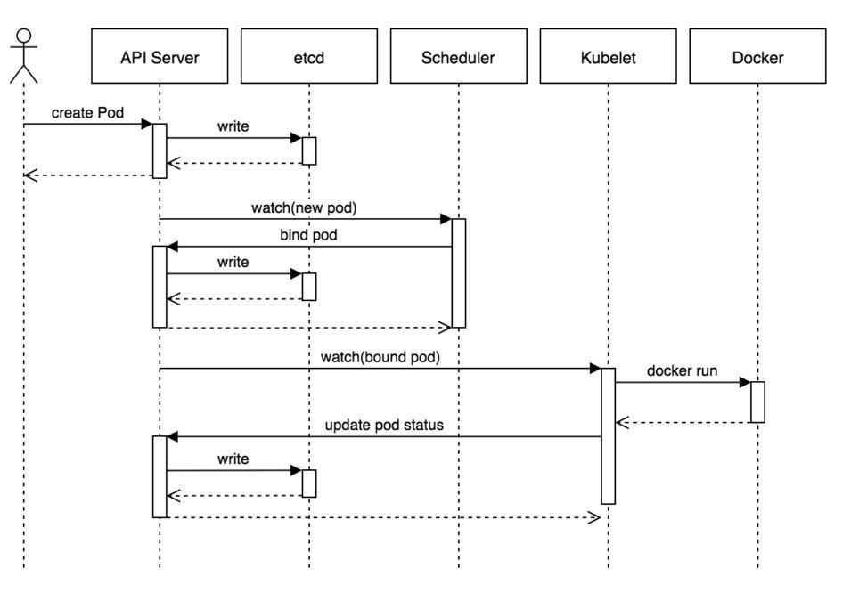
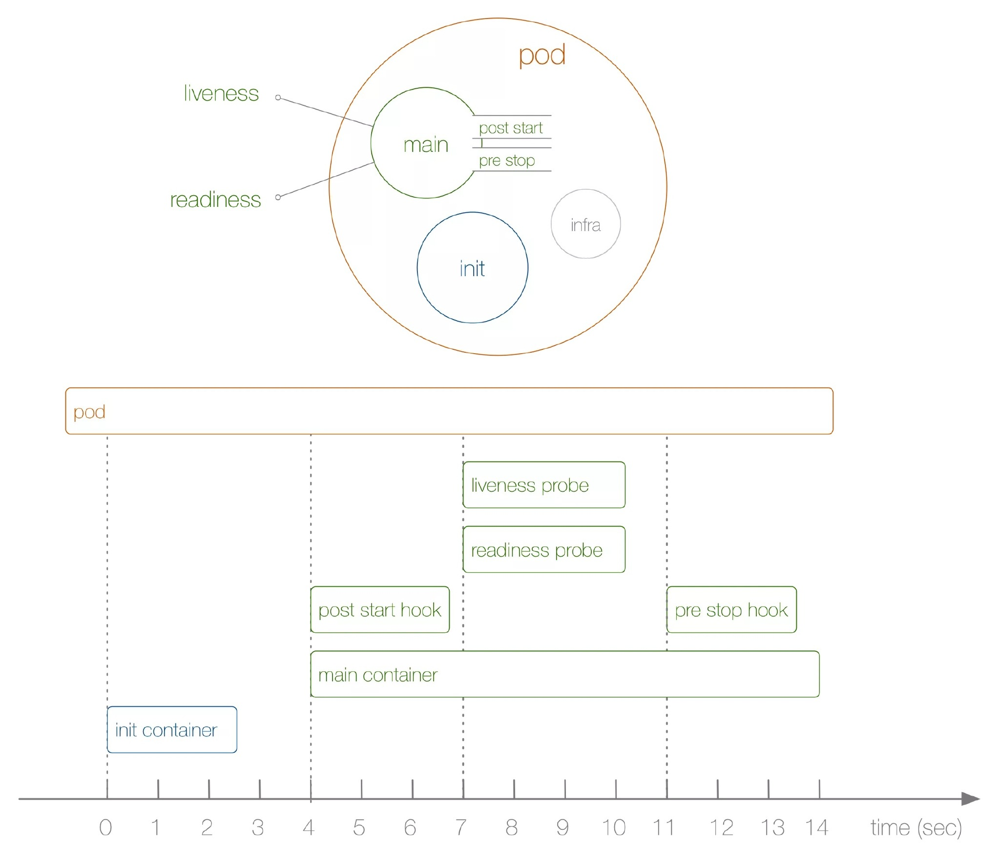
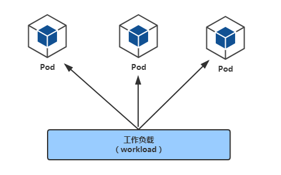

- [1. Kubernetes 概念](#1-kubernetes概念)
  * [1.1 纯容器模式的问题](#11-纯容器模式的问题)
  * [1.2 容器调度管理平台](#12-容器调度管理平台)
  * [1.3 架构图](#13-架构图)
  * [1.4 核心组件](#14-核心组件)
  * [1.5 工作流程](#15-工作流程)
  * [1.6 架构设计的几点思考](#16-架构设计的几点思考)
- [2. Kubernetes 实践](#2-kubernetes---)
  * [2.1 Kubernetes  查看组件](#21-kubernetes查看组件)
  * [2.2 理解集群资源](#22-理解集群资源)
  * [2.3 namespace](#23-namespace)
  * [2.4 使用k8s管理业务应用](#24-使用k8s管理业务应用)
  * [2.5 使用yaml格式定义Pod](#25-使用yaml格式定义Pod)
  * [2.6 Infra容器](#26-Infra容器)
  * [2.7 查看Pod详细信息](#27-查看Pod详细信息)
  * [2.8 Troubleshooting](#28-troubleshooting)
  * [2.9 更新服务版本](#29-更新服务版本)
  * [2.10 删除Pod服务](#210-删除Pod服务)
  * [2.11 Pod数据持久化](#211-Pod数据持久化)
  * [2.12 健康检查](#212-健康检查)
  * [2.13 重启策略](#213-重启策略)
  * [2.14 镜像拉取策略](#214-镜像拉取策略)
  * [2.15 pod资源限制](#215-pod资源限制)
  * [2.16 yaml拆分](#216-yaml拆分)
  * [2.17 configMap和Secret](#217-configMap和Secret)
  * [2.18 修改对应的yaml](#218-修改对应的yaml)
  * [2.19 Pod状态与生命周期](#219-Pod状态与生命周期)
- [3.  Pod控制器](#3--pod---)
  * [3.1 Workload (工作负载)](#31-workload)
  * [3.2 编写Deployment](#32-编写deployment)
  * [3.3 副本保障机制](#33副本保障机制)
  * [3.4 Pod驱逐策略](#34-Pod驱逐策略)
  * [3.5 服务更新](#35-服务更新)
- [4. Kubernetes服务访问之Service](#4-Kubernetes服务访问之Service)
  * [4.1 Service负载均衡之ClusterIP](#41--Service负载均衡之ClusterIP)
  * [4.2 Service与Pod如何关联](#42-Service与Pod如何关联)
  * [4.3 为MySQL创建svc](#43--为MySQL创建svc)
  * [4.4 服务发现](#44-服务发现)
#   1. Kubernetes概念
##  1.1 纯容器模式的问题

1. 业务容器数量庞大，哪些容器部署在哪些节点，使用了哪些端口，如何记录、管理，需要登录到每台机器去管理？
2. 跨主机通信，多个机器中的容器之间相互调用如何做，iptables规则手动维护？
3. 跨主机容器间互相调用，配置如何写？写死固定IP+端口？
4. 如何实现业务高可用？多个容器对外提供服务如何实现负载均衡？
5. 容器的业务中断了，如何可以感知到，感知到以后，如何自动启动新的容器?
6. 如何实现滚动升级保证业务的连续性？

##  1.2 容器调度管理平台
三驾马车：
Docker Swarm       Mesos        Google Kubernetes

2017年开始Kubernetes凭借强大的容器集群管理功能, 逐步占据市场,目前在容器编排领域一枝独秀

 https://kubernetes.io/ 
 
##  1.3 架构图


##  1.4 核心组件
- ETCD：分布式高性能键值数据库,存储整个集群的所有元数据
- ApiServer:  API服务器,集群资源访问控制入口,提供restAPI及安全访问控制
- Scheduler：调度器,负责把业务容器调度到最合适的Node节点
- Controller Manager：控制器管理,确保集群资源按照期望的方式运行
  - Replication Controller
  - Node controller
  - ResourceQuota Controller
  - Namespace Controller
  - ServiceAccount Controller
  - Token Controller
  - Service Controller
  - Endpoints Controller
- kubelet：运行在每个节点上的主要的“节点代理”，脏活累活
  - pod 管理：kubelet 定期从所监听的数据源获取节点上 pod/container 的期望状态（运行什么容器、运行的副本数量、网络或者存储如何配置等等），并调用对应的容器平台接口达到这个状态。
  - 容器健康检查：kubelet 创建了容器之后还要查看容器是否正常运行，如果容器运行出错，就要根据 pod 设置的重启策略进行处理.
  - 容器监控：kubelet 会监控所在节点的资源使用情况，并定时向 master 报告，资源使用数据都是通过 cAdvisor 获取的。知道整个集群所有节点的资源情况，对于 pod 的调度和正常运行至关重要
- kube-proxy：维护节点中的iptables或者ipvs规则
- kubectl: 命令行接口，用于对 Kubernetes 集群运行命令  https://kubernetes.io/zh/docs/reference/kubectl/ 

##  1.5 工作流程

1. 用户准备一个资源文件（记录了业务应用的名称、镜像地址等信息），通过调用APIServer执行创建Pod
2. APIServer收到用户的Pod创建请求，将Pod信息写入到etcd中
3. 调度器通过list-watch的方式，发现有新的pod数据，但是这个pod还没有绑定到某一个节点中
4. 调度器通过调度算法，计算出最适合该pod运行的节点，并调用APIServer，把信息更新到etcd中
5. kubelet同样通过list-watch方式，发现有新的pod调度到本机的节点了，因此调用容器运行时，去根据pod的描述信息，拉取镜像，启动容器，同时生成事件信息
6. 同时，把容器的信息、事件及状态也通过APIServer写入到etcd中

##  1.6 架构设计的几点思考
1. 系统各个组件分工明确(APIServer是所有请求入口，CM是控制中枢，Scheduler主管调度，而Kubelet负责运行)，配合流畅，整个运行机制一气呵成。
2. 除了配置管理和持久化组件ETCD，其他组件并不保存数据。意味`除ETCD外`其他组件都是无状态的。因此从架构设计上对kubernetes系统高可用部署提供了支撑。
3. 同时因为组件无状态，组件的升级，重启，故障等并不影响集群最终状态，只要组件恢复后就可以从中断处继续运行。
4. 各个组件和kube-apiserver之间的数据推送都是通过list-watch机制来实现。

#   2. Kubernetes 实践
##  2.1 Kubernetes查看组件
```
[root@k8s-master ~]# kubectl get pod -n kube-system -o wide
NAME                                 READY   STATUS    RESTARTS   AGE     IP              NODE          NOMINATED NODE   READINESS GATES
coredns-58cc8c89f4-9fbh2             1/1     Running   0          2d16h   10.244.0.3      k8s-master    <none>           <none>
coredns-58cc8c89f4-gw2vj             1/1     Running   0          2d16h   10.244.0.2      k8s-master    <none>           <none>
etcd-k8s-master                      1/1     Running   0          2d16h   172.17.176.31   k8s-master    <none>           <none>
kube-apiserver-k8s-master            1/1     Running   0          2d16h   172.17.176.31   k8s-master    <none>           <none>
kube-controller-manager-k8s-master   1/1     Running   0          2d16h   172.17.176.31   k8s-master    <none>           <none>
kube-flannel-ds-amd64-lgsl2          1/1     Running   0          2d16h   172.17.176.31   k8s-master    <none>           <none>
kube-flannel-ds-amd64-s2jx2          1/1     Running   0          2d16h   172.17.176.32   k8s-slave-1   <none>           <none>
kube-flannel-ds-amd64-zvp55          1/1     Running   0          2d16h   172.17.176.33   k8s-slave-2   <none>           <none>
kube-proxy-2xhgb                     1/1     Running   0          2d16h   172.17.176.31   k8s-master    <none>           <none>
kube-proxy-4skw7                     1/1     Running   0          2d16h   172.17.176.33   k8s-slave-2   <none>           <none>
kube-proxy-txcz8                     1/1     Running   0          2d16h   172.17.176.32   k8s-slave-1   <none>           <none>
kube-scheduler-k8s-master            1/1     Running   0          2d16h   172.17.176.31   k8s-master    <none>           <none>
```

## 2.2 理解集群资源

组件是为了支撑k8s平台的运行，安装好的软件。

资源是如何去使用k8s的能力的定义。比如，k8s可以使用Pod来管理业务应用，那么Pod就是k8s集群中的一类资源，集群中的所有资源可以提供如下方式查看：
```
kubectl api-resources
```

##  2.3 namespace
命名空间，集群内一个虚拟的概念，类似于资源池的概念，一个池子里可以有各种资源类型，绝大多数的资源都必须属于某一个namespace。集群初始化安装好之后，会默认有如下几个namespace：

```powershell
$ kubectl get namespaces
NAME                   STATUS   AGE
default                Active   84m
kube-node-lease        Active   84m
kube-public            Active   84m
kube-system            Active   84m
kubernetes-dashboard   Active   71m
```
- 所有NAMESPACED的资源，在创建的时候都需要指定namespace，若不指定，默认会在default命名空间下
- 相同namespace下的同类资源不可以重名，不同类型的资源可以重名
- 不同namespace下的同类资源可以重名
- 通常在项目使用的时候，我们会创建带有业务含义的namespace来做逻辑上的整合


##  2.4 实践--使用k8s管理业务应用        
**最小调度单元 Pod**

docker调度的是容器，在k8s集群中，最小的调度单元是Pod（豆荚）

**为什么引入Pod**

- 与容器引擎解耦

  Docker、Rkt。平台设计与引擎的具体的实现解耦

- 多容器共享网络|存储|进程 空间, 支持的业务场景更加灵活

##  2.5 使用yaml格式定义Pod
```
apiVersion: v1
kind: Pod
metadata:
  name: myblog
  namespace: luffy
  labels:
    component: myblog
spec:
  containers:
  - name: myblog
    image: 192.168.136.10:5000/myblog:v1
    env:
    - name: MYSQL_HOST   #  指定root用户的用户名
      value: "127.0.0.1"
    - name: MYSQL_PASSWD
      value: "123456"
    ports:
    - containerPort: 8002
  - name: mysql
    image: 192.168.136.10:5000/mysql:5.7-utf8
    ports:
    - containerPort: 3306
    env:
    - name: MYSQL_ROOT_PASSWORD
      value: "123456"
    - name: MYSQL_DATABASE
      value: "myblog"
```
| apiVersion | 含义                                                         |
| :--------- | :----------------------------------------------------------- |
| alpha      | 进入K8s功能的早期候选版本，可能包含Bug，最终不一定进入K8s    |
| beta       | 已经过测试的版本，最终会进入K8s，但功能、对象定义可能会发生变更。 |
| stable     | 可安全使用的稳定版本                                         |
| v1         | stable 版本之后的首个版本，包含了更多的核心对象              |
| apps/v1    | 使用最广泛的版本，像Deployment、ReplicaSets都已进入该版本    |


**资源类型与apiVersion对照表**

| Kind                  | apiVersion                              |
| :-------------------- | :-------------------------------------- |
| ClusterRoleBinding    | rbac.authorization.k8s.io/v1            |
| ClusterRole           | rbac.authorization.k8s.io/v1            |
| ConfigMap             | v1                                      |
| CronJob               | batch/v1beta1                           |
| DaemonSet             | extensions/v1beta1                      |
| Node                  | v1                                      |
| Namespace             | v1                                      |
| Secret                | v1                                      |
| PersistentVolume      | v1                                      |
| PersistentVolumeClaim | v1                                      |
| Pod                   | v1                                      |
| Deployment            | v1、apps/v1、apps/v1beta1、apps/v1beta2 |
| Service               | v1                                      |
| Ingress               | extensions/v1beta1                      |
| ReplicaSet            | apps/v1、apps/v1beta2                   |
| Job                   | batch/v1                                |
| StatefulSet           | apps/v1、apps/v1beta1、apps/v1beta2     |

##  2.6 Infra容器
**pause pod,类似docker --net=container**
1. 其中包含mysql和myblog程序以及Infra容器
2. 为了实现Pod内部的容器可以通过localhost通信，每个Pod都会启动Infra容器，然后Pod内部的其他容器的网络空间会共享该Infra容器的网络空间(Docker网络的container模式)，Infra容器只需要hang住网络空间，不需要额外的功能，因此资源消耗极低。

##  2.7 查看Pod详细信息
```
# 查看完整的yaml
[root@k8s-master ~]# kubectl get pod test-nginx-5bd8859b98-jsdjr -o yaml
#   查看pod的明细信息以及事件
[root@k8s-master ~]# kubectl describe pod test-nginx-5bd8859b98-jsdjr
```

## 2.8 Troubleshooting
```
#进入Pod内的容器
$ kubectl -n <namespace> exec <pod_name> -c <container_name> -ti /bin/sh

#查看Pod内容器日志,显示标准或者错误输出日志
$ kubectl -n <namespace> logs -f <pod_name> -c <container_name>
```

## 2.9 更新服务版本
```
$ kubectl apply -f demo-pod.yaml
```

## 2.10 删除Pod服务
```powershell
#根据文件删除
$ kubectl delete -f demo-pod.yaml

#根据pod_name删除
$ kubectl -n <namespace> delete pod <pod_name>
```

## 2.11 Pod数据持久化
```
#   查看node的label
[root@k8s-master ~]# kubectl get node --show-labels
NAME          STATUS   ROLES    AGE     VERSION   LABELS
k8s-master    Ready    master   2d19h   v1.16.2   beta.kubernetes.io/arch=amd64,beta.kubernetes.io/os=linux,kubernetes.io/arch=amd64,kubernetes.io/hostname=k8s-master,kubernetes.io/os=linux,node-role.kubernetes.io/master=
k8s-slave-1   Ready    <none>   2d19h   v1.16.2   beta.kubernetes.io/arch=amd64,beta.kubernetes.io/os=linux,kubernetes.io/arch=amd64,kubernetes.io/hostname=k8s-slave-1,kubernetes.io/os=linux
k8s-slave-2   Ready    <none>   2d19h   v1.16.2   beta.kubernetes.io/arch=amd64,beta.kubernetes.io/os=linux,kubernetes.io/arch=amd64,kubernetes.io/hostname=k8s-slave-2,kubernetes.io/os=linux
#   打label
[root@k8s-master ~]# kubectl label node k8s-slave-1 component=mysql
node/k8s-slave-1 labeled
#   编写yaml
[root@k8s-master ~]# cat one-pod.yaml 
apiVersion: v1
kind: Pod
metadata:
  name: myblog
  namespace: luffy
  labels:
    component: myblog
spec:
  volumes: 
  - name: mysql-data
    hostPath: 
      path: /opt/mysql/data
  nodeSelector:   # 使用节点选择器将Pod调度到指定label的节点
    component: mysql
  containers:
  - name: myblog
    image: 172.17.176.31:5000/myblog:v1
    env:
    - name: MYSQL_HOST   #  指定root用户的用户名
      value: "127.0.0.1"
    - name: MYSQL_PASSWD
      value: "123456"
    ports:
    - containerPort: 8002
  - name: mysql
    image: 172.17.176.31:5000/mysql:5.7-utf8
    ports:
    - containerPort: 3306
    env:
    - name: MYSQL_ROOT_PASSWORD
      value: "123456"
    - name: MYSQL_DATABASE
      value: "myblog"
    volumeMounts:
    - name: mysql-data
      mountPath: /var/lib/mysql
```
- 使用PV+PVC连接分布式存储解决方案
  - ceph
  - glusterfs
  - nfs

##  2.12 健康检查
检测容器服务是否健康的手段，若不健康，会根据设置的重启策略（restartPolicy）进行操作，两种检测机制可以分别单独设置，若不设置，默认认为Pod是健康的。
两种机制：
- LivenessProbe探针
  存活性探测：用于判断容器是否存活，即Pod是否为running状态，如果LivenessProbe探针探测到容器不健康，则kubelet将kill掉容器，并根据容器的重启策略是否重启，如果一个容器不包含LivenessProbe探针，则Kubelet认为容器的LivenessProbe探针的返回值永远成功。 
```yaml
  ...
    containers:
    - name: myblog
      image: 192.168.136.10:5000/myblog:v1
      livenessProbe:
        httpGet:
          path: /blog/index/
          port: 8002
          scheme: HTTP
        initialDelaySeconds: 10  # 容器启动后第一次执行探测是需要等待多少秒
        periodSeconds: 10 	# 执行探测的频率
        timeoutSeconds: 2		# 探测超时时间
  ...
```


- ReadinessProbe探针
  可用性探测：用于判断容器是否正常提供服务，即容器的Ready是否为True，是否可以接收请求，如果ReadinessProbe探测失败，则容器的Ready将为False， Endpoint Controller 控制器将此Pod的Endpoint从对应的service的Endpoint列表中移除，不再将任何请求调度此Pod上，直到下次探测成功。（剔除此pod不参与接收请求不会将流量转发给此Pod）。

```yaml
  ...
    containers:
    - name: myblog
      image: 192.168.136.10:5000/myblog:v1
      readinessProbe: 
        httpGet: 
          path: /blog/index/
          port: 8002
          scheme: HTTP
        initialDelaySeconds: 10 
        timeoutSeconds: 2
        periodSeconds: 10
  ...
```
三种类型：

- exec：通过执行命令来检查服务是否正常，返回值为0则表示容器健康
- httpGet方式：通过发送http请求检查服务是否正常，返回200-399状态码则表明容器健康
- tcpSocket：通过容器的IP和Port执行TCP检查，如果能够建立TCP连接，则表明容器健康

参数含义：
- initialDelaySeconds：容器启动后第一次执行探测是需要等待多少秒。
- periodSeconds：执行探测的频率。默认是10秒，最小1秒。
- timeoutSeconds：探测超时时间。默认1秒，最小1秒。
- successThreshold：探测失败后，最少连续探测成功多少次才被认定为成功。默认是1。
- failureThreshold：探测成功后，最少连续探测失败多少次
  才被认定为失败。默认是3，最小值是1。

K8S将在Pod开始**启动10s(initialDelaySeconds)后**利用HTTP访问8002端口的/blog/index/，如果**超过2s**或者返回码不在200~399内，则健康检查失败


## 2.13 重启策略
```
apiVersion: v1
kind: Pod
metadata:
  name: test-restart-policy
spec:
  restartPolicy: Always
  containers:
  - name: busybox
    image: busybox
    args:
    - /bin/sh
    - -c
    - sleep 10
```
Pod的重启策略（RestartPolicy）应用于Pod内的所有容器，并且仅在Pod所处的Node上由kubelet进行判断和重启操作。当某个容器异常退出或者健康检查失败时，kubelet将根据RestartPolicy的设置来进行相应的操作。
 Pod的重启策略包括Always、OnFailure和Never，默认值为Always。

- Always：当容器进程退出后，由kubelet自动重启该容器；
- OnFailure：当容器终止运行且退出码不为0时，由kubelet自动重启该容器；
- Never：不论容器运行状态如何，kubelet都不会重启该容器。

##  2.14 镜像拉取策略
```
spec:
  containers:
  - name: myblog
    image: 192.168.136.10:5000/demo/myblog
    imagePullPolicy: IfNotPresent
```
设置镜像的拉取策略，默认为IfNotPresent
- Always，总是拉取镜像，即使本地有镜像也从仓库拉取
- IfNotPresent ，本地有则使用本地镜像，本地没有则去仓库拉取
- Never，只使用本地镜像，本地没有则报错

为如果业务镜像使用latest作为tag，同时yaml中没有指定imagePullPolicy的话，默认会使用Always

##  2.15 pod资源限制
为了保证充分利用集群资源，且确保重要容器在运行周期内能够分配到足够的资源稳定运行，因此平台需要具备

Pod的资源限制的能力。 对于一个pod来说，资源最基础的2个的指标就是：CPU和内存。

Kubernetes提供了个采用requests和limits 两种类型参数对资源进行预分配和使用限制。

完整文件路径：`myblog/one-pod/pod-with-resourcelimits.yaml`

```yaml
...
  containers:
  - name: myblog
    image: 192.168.136.10:5000/myblog
    env:
    - name: MYSQL_HOST   #  指定root用户的用户名
      value: "127.0.0.1"
    - name: MYSQL_PASSWD
      value: "123456"
    ports:
    - containerPort: 8002
    resources:
      requests:
        memory: 100Mi
        cpu: 50m
      limits:
        memory: 500Mi
        cpu: 100m
...
```

requests：

- 容器使用的最小资源需求,作用于schedule阶段，作为容器调度时资源分配的判断依赖
- 只有当前节点上可分配的资源量 >= request 时才允许将容器调度到该节点
- request参数不限制容器的最大可使用资源
- requests.cpu被转成docker的--cpu-shares参数，与cgroup cpu.shares功能相同 (无论宿主机有多少个cpu或者内核，--cpu-shares选项都会按照比例分配cpu资源）
- requests.memory没有对应的docker参数，仅作为k8s调度依据

limits：

- 容器能使用资源的最大值
- 设置为0表示对使用的资源不做限制, 可无限的使用
- 当pod 内存超过limit时，会被oom
- 当cpu超过limit时，不会被kill，但是会限制不超过limit值
- limits.cpu会被转换成docker的–cpu-quota参数。与cgroup cpu.cfs_quota_us功能相同
- limits.memory会被转换成docker的–memory参数。用来限制容器使用的最大内存

 对于 CPU，我们知道计算机里 CPU 的资源是按`“时间片”`的方式来进行分配的，系统里的每一个操作都需要 CPU 的处理，所以，哪个任务要是申请的 CPU 时间片越多，那么它得到的 CPU 资源就越多。

然后还需要了解下 CGroup 里面对于 CPU 资源的单位换算：

```
1 CPU =  1000 millicpu（1 Core = 1000m）
```

 这里的 `m` 就是毫、毫核的意思，Kubernetes 集群中的每一个节点可以通过操作系统的命令来确认本节点的 CPU 内核数量，然后将这个数量乘以1000，得到的就是节点总 CPU 总毫数。比如一个节点有四核，那么该节点的 CPU 总毫量为 4000m。 

`docker run`命令和 CPU 限制相关的所有选项如下：

| 选项                  | 描述                                                    |
| --------------------- | ------------------------------------------------------- |
| `--cpuset-cpus=""`    | 允许使用的 CPU 集，值可以为 0-3,0,1                     |
| `-c`,`--cpu-shares=0` | CPU 共享权值（相对权重）                                |
| `cpu-period=0`        | 限制 CPU CFS 的周期，范围从 100ms~1s，即[1000, 1000000] |
| `--cpu-quota=0`       | 限制 CPU CFS 配额，必须不小于1ms，即 >= 1000，绝对限制  |

```
docker run -it --cpu-period=50000 --cpu-quota=25000 ubuntu:16.04 /bin/bash


```

将 CFS 调度的周期设为 50000，将容器在每个周期内的 CPU 配额设置为 25000，表示该容器每 50ms 可以得到 50% 的 CPU 运行时间。

> 注意：若内存使用超出限制，会引发系统的OOM机制，因CPU是可压缩资源，不会引发Pod退出或重建


##  2.16 yaml拆分
```
[root@k8s-master yaml]# cat myblog.yaml 
apiVersion: v1
kind: Pod
metadata:
  name: myblog
  namespace: luffy
  labels:
    component: myblog
spec:
  containers:
  - name: myblog
    image: 172.17.176.31:5000/myblog:v1
    imagePullPolicy: IfNotPresent
    env:
    - name: MYSQL_HOST   #  指定root用户的用户名
      value: "172.17.176.32"
    - name: MYSQL_PASSWD
      value: "123456"
    ports:
    - containerPort: 8002
    resources:
      requests:
        memory: 100Mi
        cpu: 50m
      limits:
        memory: 500Mi
        cpu: 100m
    livenessProbe:
      httpGet:
        path: /blog/index/
        port: 8002
        scheme: HTTP
      initialDelaySeconds: 10  # 容器启动后第一次执行探测是需要等待多少秒
      periodSeconds: 15         # 执行探测的频率
      timeoutSeconds: 2         # 探测超时时间
    readinessProbe: 
      httpGet: 
        path: /blog/index/
        port: 8002
        scheme: HTTP
      initialDelaySeconds: 10 
      timeoutSeconds: 2
      periodSeconds: 15
[root@k8s-master yaml]# cat mysql.yaml 
apiVersion: v1
kind: Pod
metadata:
  name: mysql
  namespace: luffy
  labels:
    component: mysql
spec:
  hostNetwork: true     # 声明pod的网络模式为host模式，效果同docker run --net=host
  volumes: 
  - name: mysql-data
    hostPath: 
      path: /opt/mysql/data
  nodeSelector:   # 使用节点选择器将Pod调度到指定label的节点
    component: mysql
  containers:
  - name: mysql
    image: 172.17.176.31:5000/mysql:5.7-utf8
    ports:
    - containerPort: 3306
    env:
    - name: MYSQL_ROOT_PASSWORD
      value: "123456"
    - name: MYSQL_DATABASE
      value: "myblog"
    resources:
      requests:
        memory: 100Mi
        cpu: 50m
      limits:
        memory: 500Mi
        cpu: 100m
    readinessProbe:
      tcpSocket:
        port: 3306
      initialDelaySeconds: 5
      periodSeconds: 10
    livenessProbe:
      tcpSocket:
        port: 3306
      initialDelaySeconds: 15
      periodSeconds: 20
    volumeMounts:
    - name: mysql-data
      mountPath: /var/lib/mysql
```

##  2.17 configMap和Secret
- 环境变量中有很多敏感的信息，比如账号密码，直接暴漏在yaml文件中存在安全性问题
- 团队内部一般存在多个项目，这些项目直接存在配置相同环境变量的情况，因此可以统一维护管理
- 对于开发、测试、生产环境，由于配置均不同，每套环境部署的时候都要修改yaml，带来额外的开销

k8s提供两类资源，configMap和Secret，可以用来实现业务配置的统一管理， 允许将配置文件与镜像文件分离，以使容器化的应用程序具有可移植性 。
- configMap
```
[root@k8s-master yaml]# cat configmap.yaml 
apiVersion: v1
kind: ConfigMap
metadata:
  name: myblog
  namespace: luffy
data:
  MYSQL_HOST: "172.17.176.32"
  MYSQL_PORT: "3306"
```

- Secret，管理敏感类的信息，默认会base64编码存储，有三种类型

  - Service Account ：用来访问Kubernetes API，由Kubernetes自动创建，并且会自动挂载到Pod的/run/secrets/kubernetes.io/serviceaccount目录中；创建ServiceAccount后，Pod中指定serviceAccount后，自动创建该ServiceAccount对应的secret；
  - Opaque ： base64编码格式的Secret，用来存储密码、密钥等；
  - kubernetes.io/dockerconfigjson ：用来存储私有docker registry的认证信息。

`myblog/two-pod/secret.yaml`

  ```yaml
  apiVersion: v1
  kind: Secret
  metadata:
    name: myblog
    namespace: luffy
  type: Opaque
  data:
    MYSQL_USER: cm9vdA==		#注意加-n参数， echo -n root|base64
    MYSQL_PASSWD: MTIzNDU2
   ```

创建并查看：
```powershell
  $ kubectl create -f secret.yaml
  $ kubectl -n luffy get secret
```
如果不习惯这种方式，可以通过如下方式：

  ```powershell
  $ cat secret.txt
  MYSQL_USER=root
  MYSQL_PASSWD=123456
  $ kubectl -n luffy create secret generic myblog --from-env-file=secret.txt 
  ```
##  2.18    修改对应的yaml
**mysql.yaml**
```
[root@k8s-master yaml]# cat mysql.yaml 
apiVersion: v1
kind: Pod
metadata:
  name: mysql
  namespace: luffy
  labels:
    component: mysql
spec:
  hostNetwork: true     # 声明pod的网络模式为host模式，效果同docker run --net=host
  volumes: 
  - name: mysql-data
    hostPath: 
      path: /opt/mysql/data
  nodeSelector:   # 使用节点选择器将Pod调度到指定label的节点
    component: mysql
  containers:
  - name: mysql
    image: 172.17.176.31:5000/mysql:5.7-utf8
    ports:
    - containerPort: 3306
    env:
    - name: MYSQL_USER
      valueFrom:
        secretKeyRef:
          name: myblog
          key: MYSQL_USER
    - name: MYSQL_ROOT_PASSWORD
      valueFrom:
        secretKeyRef:
          name: myblog
          key: MYSQL_PASSWD
    - name: MYSQL_DATABASE
      value: "myblog"
    resources:
      requests:
        memory: 100Mi
        cpu: 50m
      limits:
        memory: 500Mi
        cpu: 100m
    readinessProbe:
      tcpSocket:
        port: 3306
      initialDelaySeconds: 5
      periodSeconds: 10
    livenessProbe:
      tcpSocket:
        port: 3306
      initialDelaySeconds: 15
      periodSeconds: 20
    volumeMounts:
    - name: mysql-data
      mountPath: /var/lib/mysql
```
**myblog.yaml**  
```
[root@k8s-master yaml]# cat myblog.yaml 
apiVersion: v1
kind: Pod
metadata:
  name: myblog
  namespace: luffy
  labels:
    component: myblog
spec:
  containers:
  - name: myblog
    image: 172.17.176.31:5000/myblog:v1
    imagePullPolicy: IfNotPresent
    env:
    - name: MYSQL_HOST
      valueFrom:
        configMapKeyRef:
          name: myblog
          key: MYSQL_HOST
    - name: MYSQL_PORT
      valueFrom:
        configMapKeyRef:
          name: myblog
          key: MYSQL_PORT
    - name: MYSQL_USER
      valueFrom:
        secretKeyRef:
          name: myblog
          key: MYSQL_USER
    - name: MYSQL_PASSWD
      valueFrom:
        secretKeyRef:
          name: myblog
          key: MYSQL_PASSWD
    ports:
    - containerPort: 8002
    resources:
      requests:
        memory: 100Mi
        cpu: 50m
      limits:
        memory: 500Mi
        cpu: 100m
    livenessProbe:
      httpGet:
        path: /blog/index/
        port: 8002
        scheme: HTTP
      initialDelaySeconds: 10  # 容器启动后第一次执行探测是需要等待多少秒
      periodSeconds: 15         # 执行探测的频率
      timeoutSeconds: 2         # 探测超时时间
    readinessProbe: 
      httpGet: 
        path: /blog/index/
        port: 8002
        scheme: HTTP
      initialDelaySeconds: 10 
      timeoutSeconds: 2
      periodSeconds: 15
```

##  2.19    Pod状态与生命周期
Pod的状态如下表所示：

| 状态值               | 描述                                                         |
| -------------------- | ------------------------------------------------------------ |
| Pending              | API Server已经创建该Pod，等待调度器调度                      |
| ContainerCreating    | 拉取镜像启动容器中                                           |
| Running              | Pod内容器均已创建，且至少有一个容器处于运行状态、正在启动状态或正在重启状态 |
| Succeeded\|Completed | Pod内所有容器均已成功执行退出，且不再重启                    |
| Failed\|Error        | Pod内所有容器均已退出，但至少有一个容器退出为失败状态        |
| CrashLoopBackOff     | Pod内有容器启动失败，比如配置文件丢失导致主进程启动失败      |
| Unknown              | 由于某种原因无法获取该Pod的状态，可能由于网络通信不畅导致    |

启动关闭示意图：


**验证pod生命周期**
```
apiVersion: v1
kind: Pod
metadata:
  name: demo-start-stop
  namespace: luffy
  labels:
    component: demo-start-stop
spec:
  initContainers:
  - name: init
    image: busybox
    command: ['sh', '-c', 'echo $(date +%s): INIT >> /loap/timing']
    volumeMounts:
    - mountPath: /loap
      name: timing
  containers:
  - name: main
    image: busybox
    command: ['sh', '-c', 'echo $(date +%s): START >> /loap/timing;
sleep 10; echo $(date +%s): END >> /loap/timing;']
    volumeMounts:
    - mountPath: /loap 
      name: timing
    livenessProbe:
      exec:
        command: ['sh', '-c', 'echo $(date +%s): LIVENESS >> /loap/timing']
    readinessProbe:
      exec:
        command: ['sh', '-c', 'echo $(date +%s): READINESS >> /loap/timing']
    lifecycle:
      postStart:
        exec:
          command: ['sh', '-c', 'echo $(date +%s): POST-START >> /loap/timing']
      preStop:
        exec:
          command: ['sh', '-c', 'echo $(date +%s): PRE-STOP >> /loap/timing']
  volumes:
  - name: timing
    hostPath:
      path: /tmp/loap
```
**查看tmp**
```
[root@k8s-slave-2 ~]# cat /tmp/loap/timing 
1602483403: INIT
1602483418: START
1602483418: POST-START
1602483419: READINESS
1602483421: LIVENESS
1602483428: END
1602483445: START
1602483445: POST-START
1602483449: READINESS
1602483451: LIVENESS
1602483455: END
[root@k8s-slave-2 ~]# 
```
  
#   3.  Pod控制器
##  3.1 Workload
控制器又称工作负载是用于实现管理pod的中间层，确保pod资源符合预期的状态，pod的资源出现故障时，会尝试 进行重启，当根据重启策略无效，则会重新新建pod的资源。 



- ReplicaSet: 代用户创建指定数量的pod副本数量，确保pod副本数量符合预期状态，并且支持滚动式自动扩容和缩容功能
- Deployment：工作在ReplicaSet之上，用于管理无状态应用，目前来说最好的控制器。支持滚动更新和回滚功能，提供声明式配置
- DaemonSet：用于确保集群中的每一个节点只运行特定的pod副本，通常用于实现系统级后台任务。比如EFK服务
- Job：只要完成就立即退出，不需要重启或重建
- Cronjob：周期性任务控制，不需要持续后台运行
- StatefulSet：管理有状态应用

##  3.2 编写Deployment
**delpoy-mysql.yaml**
```
apiVersion: apps/v1
kind: Deployment
metadata:
  name: mysql
  namespace: luffy
spec:
  replicas: 1   #指定Pod副本数
  selector:             #指定Pod的选择器
    matchLabels:
      app: mysql
  template:
    metadata:
      labels:   #给Pod打label
        app: mysql
    spec:
      hostNetwork: true       # 声明pod的网络模式为host模式，效果同docker run --net=host
      volumes: 
      - name: mysql-data
        hostPath: 
          path: /opt/mysql/data
      nodeSelector:   # 使用节点选择器将Pod调度到指定label的节点
        component: mysql
      containers:
      - name: mysql
        image: 172.17.176.31:5000/mysql:5.7-utf8
        ports:
        - containerPort: 3306
        env:
        - name: MYSQL_USER
          valueFrom:
            secretKeyRef:
              name: myblog
              key: MYSQL_USER
        - name: MYSQL_ROOT_PASSWORD
          valueFrom:
            secretKeyRef:
              name: myblog
              key: MYSQL_PASSWD
        - name: MYSQL_DATABASE
          value: "myblog"
        resources:
          requests:
            memory: 100Mi
            cpu: 50m
          limits:
            memory: 500Mi
            cpu: 100m
        readinessProbe:
          tcpSocket:
            port: 3306
          initialDelaySeconds: 5
          periodSeconds: 10
        livenessProbe:
          tcpSocket:
            port: 3306
          initialDelaySeconds: 15
          periodSeconds: 20
        volumeMounts:
        - name: mysql-data
          mountPath: /var/lib/mysql
```
**deploy-myblog.yaml**
```
apiVersion: apps/v1
kind: Deployment
metadata:
  name: mysql
  namespace: luffy
spec:
  replicas: 1   #指定Pod副本数
  selector:             #指定Pod的选择器
    matchLabels:
      app: mysql
  template:
    metadata:
      labels:   #给Pod打label
        app: mysql
    spec:
      hostNetwork: true       # 声明pod的网络模式为host模式，效果同docker run --net=host
      volumes: 
      - name: mysql-data
        hostPath: 
          path: /opt/mysql/data
      nodeSelector:   # 使用节点选择器将Pod调度到指定label的节点
        component: mysql
      containers:
      - name: mysql
        image: 172.17.176.31:5000/mysql:5.7-utf8
        ports:
        - containerPort: 3306
        env:
        - name: MYSQL_USER
          valueFrom:
            secretKeyRef:
              name: myblog
              key: MYSQL_USER
        - name: MYSQL_ROOT_PASSWORD
          valueFrom:
            secretKeyRef:
              name: myblog
              key: MYSQL_PASSWD
        - name: MYSQL_DATABASE
          value: "myblog"
        resources:
          requests:
            memory: 100Mi
            cpu: 50m
          limits:
            memory: 500Mi
            cpu: 100m
        readinessProbe:
          tcpSocket:
            port: 3306
          initialDelaySeconds: 5
          periodSeconds: 10
        livenessProbe:
          tcpSocket:
            port: 3306
          initialDelaySeconds: 15
          periodSeconds: 20
        volumeMounts:
        - name: mysql-data
          mountPath: /var/lib/mysql
[root@k8s-master yaml]# cat deploy-myblog.yaml 
[root@k8s-master yaml]# cat deploy-myblog.yaml 
apiVersion: apps/v1
kind: Deployment
metadata:
  name: myblog
  namespace: luffy
spec:
  replicas: 1   #指定Pod副本数
  selector:             #指定Pod的选择器
    matchLabels:
      app: myblog
  template:
    metadata:
      labels:   #给Pod打label
        app: myblog
    spec:
      containers:
      - name: myblog
        image: 172.17.176.31:5000/myblog:v1
        imagePullPolicy: IfNotPresent
        env:
        - name: MYSQL_HOST
          valueFrom:
            configMapKeyRef:
              name: myblog
              key: MYSQL_HOST
        - name: MYSQL_PORT
          valueFrom:
            configMapKeyRef:
              name: myblog
              key: MYSQL_PORT
        - name: MYSQL_USER
          valueFrom:
            secretKeyRef:
              name: myblog
              key: MYSQL_USER
        - name: MYSQL_PASSWD
          valueFrom:
            secretKeyRef:
              name: myblog
              key: MYSQL_PASSWD
        ports:
        - containerPort: 8002
        resources:
          requests:
            memory: 100Mi
            cpu: 50m
          limits:
            memory: 500Mi
            cpu: 100m
        livenessProbe:
          httpGet:
            path: /blog/index/
            port: 8002
            scheme: HTTP
          initialDelaySeconds: 10  # 容器启动后第一次执行探测是需要等待多少秒
          periodSeconds: 15     # 执行探测的频率
          timeoutSeconds: 2             # 探测超时时间
        readinessProbe: 
          httpGet: 
            path: /blog/index/
            port: 8002
            scheme: HTTP
          initialDelaySeconds: 10 
          timeoutSeconds: 2
          periodSeconds: 15
```

查看deploy,pod,rs
```
[root@k8s-master yaml]# kubectl -n luffy get deploy,pod,rs
NAME                     READY   UP-TO-DATE   AVAILABLE   AGE
deployment.apps/myblog   1/1     1            1           8m8s
deployment.apps/mysql    1/1     1            1           10m

NAME                         READY   STATUS    RESTARTS   AGE
pod/myblog-5bbf67444-r8rr2   1/1     Running   4          8m8s
pod/mysql-5b8474cfc6-rpb5t   1/1     Running   2          5m59s

NAME                               DESIRED   CURRENT   READY   AGE
replicaset.apps/myblog-5bbf67444   1         1         1       8m8s
replicaset.apps/mysql-5b8474cfc6   1         1         1       5m59s

```
* `NAME` 列出了集群中 Deployments 的名称。
* `READY`显示当前正在运行的副本数/期望的副本数。
* `UP-TO-DATE`显示已更新以实现期望状态的副本数。
* `AVAILABLE`显示应用程序可供用户使用的副本数。
* `AGE` 显示应用程序运行的时间量。

##  3.3 副本保障机制
```
[root@k8s-master yaml]# kubectl -n luffy scale deploy myblog --replicas=3
```

##  3.4 Pod驱逐策略
K8S 有个特色功能叫 pod eviction，它在某些场景下如节点 NotReady，或者资源不足时，把 pod 驱逐至其它节点，这也是出于业务保护的角度去考虑的。

1. Kube-controller-manager: 周期性检查所有节点状态，当节点处于 NotReady 状态超过一段时间后，驱逐该节点上所有 pod。
   
- `pod-eviction-timeout`：NotReady 状态节点超过该时间后，执行驱逐，默认 5 min，适用于k8s 1.13版本之前
  
   - 1.13版本后，集群开启` TaintBasedEvictions 与TaintNodesByCondition` 功能，即[taint-based-evictions](https://kubernetes.io/docs/concepts/scheduling-eviction/taint-and-toleration/)，即节点若失联或者出现各种异常情况，k8s会自动为node打上污点，同时为pod默认添加如下容忍设置：
   
     ```yaml
       tolerations:
       - effect: NoExecute
         key: node.kubernetes.io/not-ready
         operator: Exists
         tolerationSeconds: 300
       - effect: NoExecute
         key: node.kubernetes.io/unreachable
         operator: Exists
         tolerationSeconds: 300
     ```
   
     即各pod可以独立设置驱逐容忍时间。
   
   
   
2. Kubelet: 周期性检查本节点资源，当资源不足时，按照优先级驱逐部分 pod
   - `memory.available`：节点可用内存
   - `nodefs.available`：节点根盘可用存储空间
   - `nodefs.inodesFree`：节点inodes可用数量
   - `imagefs.available`：镜像存储盘的可用空间
   - `imagefs.inodesFree`：镜像存储盘的inodes可用数量

##  3.5 服务更新
修改服务，重新打tag模拟服务更新
更新方式：
1. 修改yaml文件，使用`kubectl apply -f deploy-myblog.yaml`来应用更新

2. `kubectl -n luffy edit deploy myblog`在线更新

3. `kubectl -n luffy set image deploy myblog myblog=172.17.176.31:5000/myblog:v2 --record`

策略控制：

- maxSurge：最大激增数, 指更新过程中, 最多可以比replicas预先设定值多出的pod数量, 可以为固定值或百分比,默认为desired Pods数的25%。计算时向上取整(比如3.4，取4)，更新过程中最多会有replicas + maxSurge个pod
- maxUnavailable： 指更新过程中, 最多有几个pod处于无法服务状态 , 可以为固定值或百分比，默认为desired Pods数的25%。计算时向下取整(比如3.6，取3)

*在Deployment rollout时，需要保证Available(Ready) Pods数不低于 desired pods number - maxUnavailable; 保证所有的非异常状态Pods数不多于 desired pods number + maxSurge*。

replicas=3

running状态pod最大不超过3+1=4个，

running状态的Pod数不低于3-0=3个

1. 先新增一个v2版本的pod，目前3个v1版本+1个v2版本，共4个pod
2. 删掉一个v1版本的pod，目前2个v1版本+1个v2版本，共3个pod
3. 先新增一个v2版本的pod，目前2个v1版本+2个v2版本，共4个pod
4. 删掉一个v1版本的pod，目前1个v1版本+2个v2版本，共3个pod
5. 先新增一个v2版本的pod，目前1个v1版本+3个v2版本，共4个pod
6. 删掉一个v1版本的pod，目前0个v1版本+3个v2版本，共3个pod

以myblog为例，使用默认的策略，更新过程:

1. maxSurge 25%，2个实例，向上取整，则maxSurge为1，意味着最多可以有2+1=3个Pod，那么此时会新创建1个ReplicaSet，RS-new，把副本数置为1，此时呢，副本控制器就去创建这个新的Pod
2. 同时，maxUnavailable是25%，副本数2*25%，向下取整，则为0，意味着，滚动更新的过程中，不能有少于2个可用的Pod，因此，旧的Replica（RS-old）会先保持不动，等RS-new管理的Pod状态Ready后，此时已经有3个Ready状态的Pod了，那么由于只要保证有2个可用的Pod即可，因此，RS-old的副本数会有2个变成1个，此时，会删掉一个旧的Pod
3. 删掉旧的Pod的时候，由于总的Pod数量又变成2个了，因此，距离最大的3个还有1个Pod可以创建，所以，RS-new把管理的副本数由1改成2，此时又会创建1个新的Pod，等RS-new管理了2个Pod都ready后，那么就可以把RS-old的副本数由1置为0了，这样就完成了滚动更新

```powershell
#查看滚动更新事件
$ kubectl -n luffy describe deploy myblog
  Normal  ScalingReplicaSet  2m53s  deployment-controller  Scaled up replica set myblog-7fb9874dd9 to 1
  Normal  ScalingReplicaSet  68s    deployment-controller  Scaled down replica set myblog-5bbf67444 to 2
  Normal  ScalingReplicaSet  68s    deployment-controller  Scaled up replica set myblog-7fb9874dd9 to 2
  Normal  ScalingReplicaSet  44s    deployment-controller  Scaled down replica set myblog-5bbf67444 to 1
  Normal  ScalingReplicaSet  44s    deployment-controller  Scaled up replica set myblog-7fb9874dd9 to 3
  Normal  ScalingReplicaSet  20s    deployment-controller  Scaled down replica set myblog-5bbf67444 to 0
```


#   4. Kubernetes服务访问之Service
- Pod IP仅仅是集群内可见的虚拟IP，外部无法访问。
- Pod IP会随着Pod的销毁而消失，当ReplicaSet对Pod进行动态伸缩时，Pod IP可能随时随地都会变化，这样对于我们访问这个服务带来了难度。

##  4.1 Service负载均衡之ClusterIP
service是一组pod的服务抽象，相当于一组pod的LB，负责将请求分发给对应的pod。service会为这个LB提供一个IP，一般称为cluster IP 。使用Service对象，通过selector进行标签选择，找到对应的Pod:
```
apiVersion: v1
kind: Service
metadata:
  name: myblog
  namespace: luffy
spec:
  ports:
  - port: 80
    protocol: TCP
    targetPort: 8002
  selector:
    app: myblog
  type: ClusterIP
```
**查看svc**
```
[root@k8s-master yaml]# kubectl -n luffy get svc
NAME     TYPE        CLUSTER-IP       EXTERNAL-IP   PORT(S)   AGE
myblog   ClusterIP   10.106.250.146   <none>        80/TCP    28s
[root@k8s-master yaml]# kubectl -n luffy describe svc myblog
Name:              myblog
Namespace:         luffy
Labels:            <none>
Annotations:       <none>
Selector:          app=myblog
Type:              ClusterIP
IP:                10.106.250.146
Port:              <unset>  80/TCP
TargetPort:        8002/TCP
Endpoints:         10.244.0.5:8002,10.244.1.11:8002,10.244.2.6:8002
Session Affinity:  None
Events:            <none>
```
##  4.2 Service与Pod如何关联

service对象创建的同时，会创建同名的endpoints对象，若服务设置了readinessProbe, 当readinessProbe检测失败时，endpoints列表中会剔除掉对应的pod_ip，这样流量就不会分发到健康检测失败的Pod中
```
[root@k8s-master yaml]# kubectl -n luffy get endpoints
NAME     ENDPOINTS                                          AGE
myblog   10.244.0.5:8002,10.244.1.11:8002,10.244.2.6:8002   4m9s
```
##  4.3 为MySQL创建svc
为mysql服务创建service
```
apiVersion: v1
kind: Service
metadata:
  name: mysql
  namespace: luffy
spec:
  ports:
  - port: 3306
    protocol: TCP
    targetPort: 3306
  selector:
    app: mysql
  type: ClusterIP
```

##  4.4 服务发现
 `CoreDNS`是一个`Go`语言实现的链式插件`DNS服务端`，是CNCF成员，是一个高性能、易扩展的`DNS服务端`。 
在k8s集群中，组件之间可以通过定义的Service名称实现通信。服务发现：
```
[root@k8s-master yaml]# kubectl -n luffy get svc
NAME     TYPE        CLUSTER-IP       EXTERNAL-IP   PORT(S)    AGE
myblog   ClusterIP   10.106.250.146   <none>        80/TCP     7m34s
mysql    ClusterIP   10.98.4.243      <none>        3306/TCP   2m14s
```
虽然podip和clusterip都不固定，但是service name是固定的，而且具有完全的跨集群可移植性，因此组件之间调用的同时，完全可以通过service name去通信，这样避免了大量的ip维护成本，使得服务的yaml模板更加简单。因此可以对mysql和myblog的部署进行优化改造：

1. mysql可以去掉hostNetwork部署，使得服务只暴漏在k8s集群内部网络
2. configMap中数据库地址可以换成Service名称，这样跨环境的时候，配置内容基本上可以保持不用变化

修改configmap.yaml
```
[root@k8s-master yaml]# cat configmap.yaml 
apiVersion: v1
kind: ConfigMap
metadata:
  name: myblog
  namespace: luffy
data:
  MYSQL_HOST: "mysql"
  MYSQL_PORT: "3306"
```
查看myblog的pod解析地址
```
[root@k8s-master yaml]# kubectl  -n luffy exec -it myblog-7fb9874dd9-bsj6s cat /etc/resolv.conf 
nameserver 10.96.0.10
search luffy.svc.cluster.local svc.cluster.local cluster.local
options ndots:5
```
**10.96.0.10从哪里来**
```
[root@k8s-master yaml]# kubectl -n kube-system get svc
NAME       TYPE        CLUSTER-IP   EXTERNAL-IP   PORT(S)                  AGE
kube-dns   ClusterIP   10.96.0.10   <none>        53/UDP,53/TCP,9153/TCP   3d20h
# 启动pod的时候，会把kube-dns服务的cluster-ip地址注入到pod的resolve解析配置中，同时添加对应的namespace的search域。 因此跨namespace通过service name访问的话，需要添加对应的namespace名称，
[root@k8s-master yaml]# kubectl -n luffy get svc
NAME     TYPE        CLUSTER-IP       EXTERNAL-IP   PORT(S)    AGE
myblog   ClusterIP   10.106.250.146   <none>        80/TCP     13m
mysql    ClusterIP   10.98.4.243      <none>        3306/TCP   7m49s
```