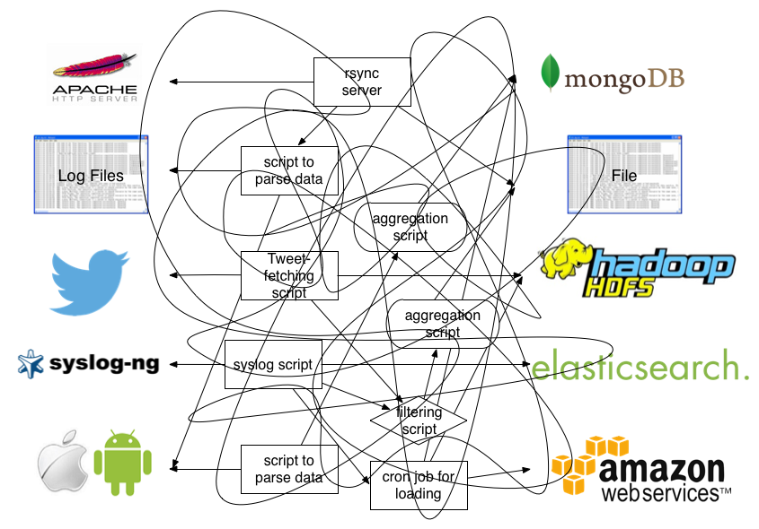

- [1. Kubernetes集群的日志及监控](#1-ubernetes集群的日志及监控)
  * [1.1 k8s日志收集架构](#11-k8s日志收集架构)
    + [1.1.1 使用节点级日志代理](#111-使用节点级日志代理)
    + [1.1.2 使用sidecar容器和日志代理](#112-使用sidecar容器和日志代理)
    + [1.1.3 从应用中直接暴露日志目录](#113-从应用中直接暴露日志目录)
- [2. EFK架构工作流程](#2-EFK架构工作流程)
  * [2.1 EFK架构工作流程](#21-EFK架构工作流程)
  * [2.2 Fluentd架构](#22-Fluentd架构)
  * [2.3 fluentd的buffer事件缓冲模型](#23-fluentd的buffer事件缓冲模型)
  * [2.4 实现业务应用日志的收集及字段解析](#24-实现业务应用日志的收集及字段解析)
  * [2.4 使用ruby实现日志字段转换及自定义处理](#24-使用ruby实现日志字段转换及自定义处理)
- [3. ConfigMap](#3-configmap)
  * [3.1 单文件挂载到空目录](#31-单文件挂载到空目录)
  * [3.2 多文件挂载](#32-多文件挂载)
  * [3.3 挂载子路径](#33-挂载子路径)
- [4.  部署es服务](#4-部署es服务)
  * [4.1 如何部署](#41-如何部署)
  * [4.2 使用StatefulSet管理有状态服务](#42-使用StatefulSet管理有状态服务)
#   1. Kubernetes集群的日志及监控
##  1.1 k8s日志收集架构

https://kubernetes.io/docs/concepts/cluster-administration/logging/ 

总体分为三种方式：
- 使用在每个节点上运行的节点级日志记录代理。
- 在应用程序的 pod 中，包含专门记录日志的 sidecar 容器。
- 将日志直接从应用程序中推送到日志记录后端。

### 1.1.1 使用节点级日志代理


容器日志驱动：

 https://docs.docker.com/config/containers/logging/configure/ 

查看当前的docker主机的驱动：

```powershell
$ docker info --format '{{.LoggingDriver}}'
```

json-file格式，docker会默认将标准和错误输出保存为宿主机的文件，路径为：

`/var/lib/docker/containers/<container-id>/<container-id>-json.log`

并且可以设置日志轮转：

```json
{
  "log-driver": "json-file",
  "log-opts": {
    "max-size": "10m",
    "max-file": "3",
    "labels": "production_status",
    "env": "os,customer"
  }
}
```

优势：

- 部署方便，使用DaemonSet类型控制器来部署agent即可
- 对业务应用的影响最小，没有侵入性

劣势:

- 只能收集标准和错误输出，对于容器内的文件日志，暂时收集不到

### 1.1.2 使用sidecar容器和日志代理
**方式一：sidecar** 容器将应用程序日志传送到自己的标准输出。

  思路：在pod中启动一个sidecar容器，把容器内的日志文件吐到标准输出，由宿主机中的日志收集agent进行采集。


  ```powershell
  $ cat count-pod.yaml
  apiVersion: v1
  kind: Pod
  metadata:
    name: counter
  spec:
    containers:
    - name: count
      image: busybox
      args:
      - /bin/sh
      - -c
      - >
        i=0;
        while true;
        do
          echo "$i: $(date)" >> /var/log/1.log;
          echo "$(date) INFO $i" >> /var/log/2.log;
          i=$((i+1));
          sleep 1;
        done
      volumeMounts:
      - name: varlog
        mountPath: /var/log
    - name: count-log-1
      image: busybox
      args: [/bin/sh, -c, 'tail -n+1 -f /var/log/1.log']
      volumeMounts:
      - name: varlog
        mountPath: /var/log
    - name: count-log-2
      image: busybox
      args: [/bin/sh, -c, 'tail -n+1 -f /var/log/2.log']
      volumeMounts:
      - name: varlog
        mountPath: /var/log
    volumes:
    - name: varlog
      emptyDir: {}
      
  $ kubectl create -f counter-pod.yaml
  $ kubectl logs -f counter -c count-log-1
  ```
优势：
  - 可以实现容器内部日志收集
  - 对业务应用的侵入性不大
劣势：
  - 每个业务pod都需要做一次改造
  - 增加了一次日志的写入，对磁盘使用率有一定影响

**方式二：sidecar**

容器运行一个日志代理，配置该日志代理以便从应用容器收集日志。


  思路：直接在业务Pod中使用sidecar的方式启动一个日志收集的组件（比如fluentd），这样日志收集可以将容器内的日志当成本地文件来进行收取。

  优势：不用往宿主机存储日志，本地日志完全可以收集

  劣势：每个业务应用额外启动一个日志agent，带来额外的资源损耗 


### 1.1.3 从应用中直接暴露日志目录


目前来讲，最建议的是采用节点级的日志代理。

方案一：自研方案，实现一个自研的日志收集agent，大致思路：

- 针对容器的标准输出及错误输出，使用常规的方式，监听宿主机中的容器输出路径即可
- 针对容器内部的日志文件
  - 在容器内配置统一的环境变量，比如LOG_COLLECT_FILES，指定好容器内待收集的日志目录及文件
  - agent启动的时候挂载docker.sock文件及磁盘的根路径
  - 监听docker的容器新建、删除事件，通过docker的api，查出容器的存储、环境变量、k8s属性等信息
  - 配置了LOG_COLLECT_FILES环境变量的容器，根据env中的日志路径找到主机中对应的文件路径，然后生成收集的配置文件
  - agent与开源日志收集工具（Fluentd或者filebeat等）配合，agent负责下发配置到收集工具中并对进程做reload


方案二：日志使用开源的Agent进行收集（EFK方案），适用范围广，可以满足绝大多数日志收集、展示的需求。

# 2. EFK架构工作流程


## 2.1 EFK架构工作流程
- Elasticsearch

  一个开源的分布式、Restful 风格的搜索和数据分析引擎，它的底层是开源库Apache Lucene。它可以被下面这样准确地形容：

  - 一个分布式的实时文档存储，每个字段可以被索引与搜索；
  - 一个分布式实时分析搜索引擎；
  - 能胜任上百个服务节点的扩展，并支持 PB 级别的结构化或者非结构化数据。

- Kibana

  Kibana是一个开源的分析和可视化平台，设计用于和Elasticsearch一起工作。可以通过Kibana来搜索，查看，并和存储在Elasticsearch索引中的数据进行交互。也可以轻松地执行高级数据分析，并且以各种图标、表格和地图的形式可视化数据。

- [Fluentd](https://docs.fluentd.org/)

  一个针对日志的收集、处理、转发系统。通过丰富的插件系统，可以收集来自于各种系统或应用的日志，转化为用户指定的格式后，转发到用户所指定的日志存储系统之中。 

 

  Fluentd 通过一组给定的数据源抓取日志数据，处理后（转换成结构化的数据格式）将它们转发给其他服务，比如 Elasticsearch、对象存储、kafka等等。Fluentd 支持超过300个日志存储和分析服务，所以在这方面是非常灵活的。主要运行步骤如下

  1. 首先 Fluentd 从多个日志源获取数据
  2. 结构化并且标记这些数据
  3. 然后根据匹配的标签将数据发送到多个目标服务

##  2.2 Fluentd架构

为什么推荐使用fluentd作为k8s体系的日志收集工具？

- 云原生：https://github.com/kubernetes/kubernetes/tree/master/cluster/addons/fluentd-elasticsearch 
- 将日志文件JSON化

- 可插拔架构设计

- 极小的资源占用基于C和Ruby语言,30-40MB，13,000 events/second/core 

- 极强的可靠性
- 基于内存和本地文件的缓存
- 强大的故障转移

**fluentd事件流的生命周期及指令配置**
 https://docs.fluentd.org/v/0.12/quickstart/life-of-a-fluentd-event 

```
Input -> filter 1 -> ... -> filter N -> Buffer -> Output
```
启动命令

```
$ fluentd -c fluent.conf
```

指令介绍：

- [source](https://docs.fluentd.org/v/0.12/input) ，数据源，对应Input
  通过使用 source 指令，来选择和配置所需的输入插件来启用 Fluentd 输入源， source 把事件提交到 fluentd 的路由引擎中。使用type来区分不同类型的数据源。如下配置可以监听指定文件的追加输入：

  ```powershell
  <source>
    @type tail
    path /var/log/httpd-access.log
    pos_file /var/log/td-agent/httpd-access.log.pos
    tag myapp.access
    format apache2
  </source>
  ```
- filter，Event processing pipeline（事件处理流）
   filter 可以串联成 pipeline，对数据进行串行处理，最终再交给 match 输出。 如下可以对事件内容进行处理：
  ```powershell
  <source>
    @type http
    port 9880
  </source>
  
  <filter myapp.access>
    @type record_transformer
    <record>
      host_param “#{Socket.gethostname}”
    </record>
  </filter>
  ```
  filter 获取数据后，调用内置的 @type record_transformer 插件，在事件的 record 里插入了新的字段 host_param，然后再交给 match 输出。
- label指令
  可以在 `source` 里指定 `@label`，这个 source 所触发的事件就会被发送给指定的 label 所包含的任务，而不会被后续的其他任务获取到。 
  ```yaml
  <source>
    @type forward
  </source>
  
  <source>
  ### 这个任务指定了 label 为 @SYSTEM
  ### 会被发送给 <label @SYSTEM>
  ### 而不会被发送给下面紧跟的 filter 和 match
    @type tail
    @label @SYSTEM
    path /var/log/httpd-access.log
    pos_file /var/log/td-agent/httpd-access.log.pos
    tag myapp.access
    format apache2
  </source>
  
  <filter access.**>
    @type record_transformer
    <record>
    # …
    </record>
  </filter>
  
  <match **>
    @type elasticsearch
    # …
  </match>
  
  <label @SYSTEM>
    ### 将会接收到上面 @type tail 的 source event
    <filter var.log.middleware.**>
      @type grep
      # …
    </filter>
  
    <match **>
      @type s3
      # …
    </match>
  </label>
  ```
  
- match，匹配输出
  查找匹配 “tags” 的事件，并处理它们。match 命令的最常见用法是将事件输出到其他系统（因此，与 match 命令对应的插件称为 “输出插件”） 
  ```powershell
  <source>
    @type http
    port 9880
  </source>
  
  <filter myapp.access>
    @type record_transformer
    <record>
      host_param “#{Socket.gethostname}”
    </record>
  </filter>
  
  <match myapp.access>
    @type file
    path /var/log/fluent/access
  </match>
  ```

事件的结构：

time：事件的处理时间

tag：事件的来源，在fluentd.conf中配置

record：真实的日志内容，json对象

比如，下面这条原始日志：


## 2.3 fluentd的buffer事件缓冲模型


因为每个事件数据量通常很小，考虑数据传输效率、稳定性等方面的原因，所以基本不会每条事件处理完后都会立马写入到output端，因此fluentd建立了缓冲模型，模型中主要有两个概念：

- buffer_chunk：事件缓冲块，用来存储本地已经处理完待发送至目的端的事件，可以设置每个块的大小。
- buffer_queue：存储chunk的队列，可以设置长度

可以设置的参数，主要有：

- buffer_type，缓冲类型，可以设置file或者memory
- buffer_chunk_limit，每个chunk块的大小，默认8MB
- buffer_queue_limit ，chunk块队列的最大长度，默认256
- flush_interval ，flush一个chunk的时间间隔
-  retry_limit ，chunk块发送失败重试次数，默认17次，之后就丢弃该chunk数据
-  retry_wait ，重试发送chunk数据的时间间隔，默认1s，第2次失败再发送的话，间隔2s，下次4秒，以此类推

大致的过程为：

随着fluentd事件的不断生成并写入chunk，缓存块持变大，当缓存块满足buffer_chunk_limit大小或者新的缓存块诞生超过flush_interval时间间隔后，会推入缓存queue队列尾部，该队列大小由buffer_queue_limit决定。

每次有新的chunk入列，位于队列最前部的chunk块会立即写入配置的存储后端，比如配置的是kafka，则立即把数据推入kafka中。

比较理想的情况是每次有新的缓存块进入缓存队列，则立马会被写入到后端，同时，新缓存块也持续入列，但是入列的速度不会快于出列的速度，这样基本上缓存队列处于空的状态，队列中最多只有一个缓存块。

但是实际情况考虑网络等因素，往往缓存块被写入后端存储的时候会出现延迟或者写入失败的情况，当缓存块写入后端失败时，该缓存块还会留在队列中，等retry_wait时间后重试发送，当retry的次数达到retry_limit后，该缓存块被销毁（数据被丢弃）。

此时缓存队列持续有新的缓存块进来，如果队列中存在很多未及时写入到后端存储的缓存块的话，当队列长度达到buffer_queue_limit大小，则新的事件被拒绝，fluentd报错，error_class=Fluent::Plugin::Buffer::BufferOverflowError error="buffer space has too many data"。

还有一种情况是网络传输缓慢的情况，若每3秒钟会产生一个新块，但是写入到后端时间却达到了30s钟，队列长度为100，那么每个块出列的时间内，又有新的10个块进来，那么队列很快就会被占满，导致异常出现。

## 2.4 实现业务应用日志的收集及字段解析
目标：收集容器内的nginx应用的access.log日志，并解析日志字段为JSON格式，原始日志的格式为：
```powershell
$ tail -f access.log
...
53.49.146.149 1561620585.973 0.005 502 [27/Jun/2019:15:29:45 +0800] 178.73.215.171 33337 GET https
```
收集并处理成：

```json
{
    "serverIp": "53.49.146.149",
    "timestamp": "1561620585.973",
    "respondTime": "0.005",
    "httpCode": "502",
    "eventTime": "27/Jun/2019:15:29:45 +0800",
    "clientIp": "178.73.215.171",
    "clientPort": "33337",
    "method": "GET",
    "protocol": "https"
}
```

思路：

- 配置fluent.conf
  - 使用@tail插件通过监听access.log文件
  - 用filter实现对nginx日志格式解析
- 启动fluentd服务
- 手动追加内容至access.log文件
- 观察本地输出内容是否符合预期

`fluent.conf`

```powershell
<source>
	@type tail
	@label @nginx_access
	path /fluentd/access.log
	pos_file /fluentd/nginx_access.posg
	tag nginx_access
	format none
	@log_level trace
</source>
<label @nginx_access>
   <filter  nginx_access>
       @type parser
	   key_name message
	   format  /(?<serverIp>[^ ]*) (?<timestamp>[^ ]*) (?<respondTime>[^ ]*) (?<httpCode>[^ ]*) \[(?<eventTime>[^\]]*)\] (?<clientIp>[^ ]*) (?<clientPort>[^ ]*) (?<method>[^ ]*) (?<protocol>[^ ]*)/
   </filter>
   <match  nginx_access>
     @type stdout
   </match>
</label>
```
启动服务，追加文件内容：
镜像地址：
https://quay.io/repository/fluentd_elasticsearch/fluentd?tab=tags

```powershell
$ docker run -u root --rm -ti 172.17.176.31:5000/fluentd_elasticsearch/fluentd:v2.5.2 sh
/ # cd /fluentd/
/ # touch access.log
/ # fluentd -c /fluentd/etc/fluent.conf
/ # echo '53.49.146.149 1561620585.973 0.005 502 [27/Jun/2019:15:29:45 +0800] 178.73.215.171 33337 GET https' >>/fluentd/access.log
```

使用该网站进行正则校验： [http://fluentular.herokuapp.com](http://fluentular.herokuapp.com/) 

## 2.4 使用ruby实现日志字段转换及自定义处理

```powershell
<source>
	@type tail
	@label @nginx_access
	path /fluentd/access.log
	pos_file /fluentd/nginx_access.posg
	tag nginx_access
	format none
	@log_level trace
</source>
<label @nginx_access>
   <filter  nginx_access>
       @type parser
	   key_name message
	   format  /(?<serverIp>[^ ]*) (?<timestamp>[^ ]*) (?<respondTime>[^ ]*) (?<httpCode>[^ ]*) \[(?<eventTime>[^\]]*)\] (?<clientIp>[^ ]*) (?<clientPort>[^ ]*) (?<method>[^ ]*) (?<protocol>[^ ]*)/
   </filter>
   <filter  nginx_access>   
	   @type record_transformer
	   enable_ruby
       <record>
		host_name "#{Socket.gethostname}"
        my_key  "my_val"
        tls ${record["protocol"].index("https") ? "true" : "false"}
       </record>
   </filter>
   <match  nginx_access>
     @type stdout
   </match>
</label>
```

#   3. ConfigMap
##  3.1 单文件挂载到空目录
```
[root@k8s-master configmap]# cat application-1.conf 
name: "application"
platform: "linux"
purpose: "demo"
company: "luffy"
version: "v2.1.0"
```
该配置文件在k8s中可以通过configmap来管理，通常我们有如下两种方式来管理配置文件：
- 通过kubectl命令行来生成configmap
```
# 通过文件直接创建
[root@k8s-master configmap]# kubectl -n default create configmap application-config --from-file=application-1.conf
configmap/application-config created
# 会生成配置文件，查看内容，configmap的key为文件名字
[root@k8s-master configmap]# kubectl -n default get cm application-config -oyaml
apiVersion: v1
data:
  application-1.conf: |
    name: "application"
    platform: "linux"
    purpose: "demo"
    company: "luffy"
    version: "v2.1.0"
kind: ConfigMap
metadata:
  creationTimestamp: "2020-10-27T03:31:15Z"
  name: application-config
  namespace: default
  resourceVersion: "2518550"
  selfLink: /api/v1/namespaces/default/configmaps/application-config
  uid: 994374c6-dba8-441b-9088-779b7154a791
```
- 通过yaml文件直接创建
```
cat application-config.yaml
apiVersion: v1
kind: ConfigMap
metadata:
  name: application-config
  namespace: default
data:
  application-1.conf: |
    name: "application"
    platform: "linux"
    purpose: "demo"
    company: "luffy"
    version: "v2.1.0"

# 创建configmap
$ kubectl create -f application-config.yaml
```
准备一个`demo-deployment.yaml`文件，挂载上述configmap到`/etc/application/`中
```
[root@k8s-master configmap]# cat demo-deployment.yaml 
apiVersion: apps/v1
kind: Deployment
metadata:
  name: demo
  namespace: default
spec:
  selector:
    matchLabels:
      app: demo
  template:
    metadata:
      labels:
        app: demo
    spec:
      volumes:
      - configMap:
          name: application-config
        name: config
      containers:
      - name: nginx
        image: nginx:alpine
        imagePullPolicy: IfNotPresent
        volumeMounts:
        - mountPath: "/etc/application"
          name: config
[root@k8s-master configmap]# kubectl create -f demo-deployment.yaml 
deployment.apps/demo created
```
修改configmap文件的内容，观察pod中是否自动感知变化：

```powershell
$ kubectl edit cm application-config
```

> 整个configmap文件直接挂载到pod中，若configmap变化，pod会自动感知并拉取到pod内部。
>
> 但是pod内的进程不会自动重启，所以很多服务会实现一个内部的reload接口，用来加载最新的配置文件到进程中。

##  3.2 多文件挂载
```
[root@k8s-master configmap]# cat application-2.conf 
name: "application-2"
platform: "linux"
purpose: "demo"
company: "luffy"
version: "v2.1.0"
[root@k8s-master configmap]# kubectl create cm application-config --from-file=application-1.conf --from-file=application-2.conf

/etc/application # ls -l
total 0
lrwxrwxrwx    1 root     root            25 Oct 27 03:33 application-1.conf -> ..data/application-1.conf
lrwxrwxrwx    1 root     root            25 Oct 27 03:35 application-2.conf -> ..data/application-2.conf
```
此时，是挂载到pod内的空目录中`/etc/application`，假如想挂载到pod已存在的目录中，比如：
```
[root@k8s-master configmap]# cat demo-deployment.yaml 
apiVersion: apps/v1
kind: Deployment
metadata:
  name: demo
  namespace: default
spec:
  selector:
    matchLabels:
      app: demo
  template:
    metadata:
      labels:
        app: demo
    spec:
      volumes:
      - configMap:
          name: application-config
        name: config
      containers:
      - name: nginx
        image: nginx:alpine
        imagePullPolicy: IfNotPresent
        volumeMounts:
        - mountPath: "/etc/profile.d"
          name: config
```
**查看pod,文件已经被覆盖**
```
[root@k8s-master configmap]# kubectl exec -it demo-7cdbf8965-w4bqp sh
/ # cd /etc/profile.d/
/etc/profile.d # ls -l
total 0
lrwxrwxrwx    1 root     root            25 Oct 27 03:37 application-1.conf -> ..data/application-1.conf
lrwxrwxrwx    1 root     root            25 Oct 27 03:37 application-2.conf -> ..data/application-2.conf
```

##  3.3 挂载子路径
实现多个配置文件，可以挂载到pod内的不同的目录中。比如：

- `application-1.conf`挂载到`/etc/application/`
- `application-2.conf`挂载到`/etc/profile.d`

```
[root@k8s-master configmap]# cat demo-deployment.yaml 
apiVersion: apps/v1
kind: Deployment
metadata:
  name: demo
  namespace: default
spec:
  selector:
    matchLabels:
      app: demo
  template:
    metadata:
      labels:
        app: demo
    spec:
      volumes:
      - name: config
        configMap:
          name: application-config
          items:
          - key: application-1.conf
            path: application1
          - key: application-2.conf
            path: application2
      containers:
      - name: nginx
        image: nginx:alpine
        imagePullPolicy: IfNotPresent
        volumeMounts:
        - mountPath: "/etc/application/application-1.conf"
          name: config
          subPath: application1
        - mountPath: "/etc/profile.d/application-2.conf"
          name: config
          subPath: application2
[root@k8s-master configmap]# kubectl apply -f demo-deployment.yaml 
deployment.apps/demo configured
```

> 使用subPath挂载到Pod内部的文件，不会自动感知原有ConfigMap的变更

#   4.  部署es服务
##  4.1 如何部署
1. es生产环境是部署es集群，通常会使用statefulset进行部署
3. es默认使用elasticsearch用户启动进程，es的数据目录是通过宿主机的路径挂载，因此目录权限被主机的目录权限覆盖，因此可以利用initContainer容器在es进程启动之前把目录的权限修改掉，注意init container要用特权模式启动。
4. 若希望使用helm部署，参考 https://github.com/helm/charts/tree/master/stable/elasticsearch 

## 4.2 使用StatefulSet管理有状态服务
```
[root@k8s-master efk]# cat es-config.yaml 
apiVersion: v1
kind: ConfigMap
metadata:
  name: es-config
  namespace: logging
data:
  elasticsearch.yml: |
    cluster.name: "luffy-elasticsearch"
    node.name: "${POD_NAME}"
    network.host: 0.0.0.0
    discovery.seed_hosts: "es-svc-headless"
    cluster.initial_master_nodes: "elasticsearch-0,elasticsearch-1,elasticsearch-2"
```
```
[root@k8s-master efk]# cat es-statefulset.yaml 
apiVersion: apps/v1
kind: StatefulSet
metadata:
  name: elasticsearch
  namespace: logging
  labels:
    k8s-app: elasticsearch
spec:
  replicas: 3
  serviceName: es-svc-headless
  selector:
    matchLabels:
      k8s-app: elasticsearch
  template:
    metadata:
      labels:
        k8s-app: elasticsearch
    spec:
      initContainers:
      - command:
        - /sbin/sysctl
        - -w
        - vm.max_map_count=262144
        image: alpine:3.6
        imagePullPolicy: IfNotPresent
        name: elasticsearch-logging-init
        resources: {}
        securityContext:
          privileged: true
      - name: fix-permissions
        image: alpine:3.6
        command: ["sh", "-c", "chown -R 1000:1000 /usr/share/elasticsearch/data"]
        securityContext:
          privileged: true
        volumeMounts:
        - name: es-data-volume
          mountPath: /usr/share/elasticsearch/data
      containers:
      - name: elasticsearch
        image: 172.17.176.31:5000/elasticsearch/elasticsearch:7.4.2
        env:
          - name: POD_NAME
            valueFrom:
              fieldRef:
                fieldPath: metadata.name
        resources:
          limits:
            cpu: '1'
            memory: 2Gi
          requests:
            cpu: '1'
            memory: 2Gi
        ports:
        - containerPort: 9200
          name: db
          protocol: TCP
        - containerPort: 9300
          name: transport
          protocol: TCP
        volumeMounts:
          - name: es-config-volume
            mountPath: /usr/share/elasticsearch/config/elasticsearch.yml
            subPath: elasticsearch.yml
          - name: es-data-volume
            mountPath: /usr/share/elasticsearch/data
      volumes:
        - name: es-config-volume
          configMap:
            name: es-config
            items:
            - key: elasticsearch.yml
              path: elasticsearch.yml
  volumeClaimTemplates:
  - metadata:
      name: es-data-volume
    spec:
      accessModes: ["ReadWriteOnce"]
      storageClassName: "nfs"
      resources:
        requests:
          storage: 5Gi
```
```
[root@k8s-master efk]# cat es-svc-headless.yaml 
apiVersion: v1
kind: Service
metadata:
  name: es-svc-headless
  namespace: logging
  labels:
    k8s-app: elasticsearch
spec:
  selector:
    k8s-app: elasticsearch
  clusterIP: None
  ports:
  - name: in
    port: 9300
    protocol: TCP
```
```
[root@k8s-master efk]# cat es-svc.yaml 
apiVersion: v1
kind: Service
metadata:
  name: es-svc
  namespace: logging
  labels:
    k8s-app: elasticsearch
spec:
  selector:
    k8s-app: elasticsearch
  ports:
  - name: out
    port: 9200
    protocol: TCP
```

**查看服务状态**
```
[root@k8s-master efk]# kubectl -n logging get pods
NAME              READY   STATUS    RESTARTS   AGE
elasticsearch-0   1/1     Running   0          76s
elasticsearch-1   1/1     Running   0          61s
elasticsearch-2   1/1     Running   0          40s
[root@k8s-master efk]# kubectl -n logging get svc
NAME              TYPE        CLUSTER-IP     EXTERNAL-IP   PORT(S)    AGE
es-svc            ClusterIP   10.110.173.5   <none>        9200/TCP   6m16s
es-svc-headless   ClusterIP   None           <none>        9300/TCP   6m17s
[root@k8s-master efk]# curl  10.110.173.5:9200
{
  "name" : "elasticsearch-0",
  "cluster_name" : "luffy-elasticsearch",
  "cluster_uuid" : "5lzsD_0OTeaiS_ZV0xTQlw",
  "version" : {
    "number" : "7.4.2",
    "build_flavor" : "default",
    "build_type" : "docker",
    "build_hash" : "2f90bbf7b93631e52bafb59b3b049cb44ec25e96",
    "build_date" : "2019-10-28T20:40:44.881551Z",
    "build_snapshot" : false,
    "lucene_version" : "8.2.0",
    "minimum_wire_compatibility_version" : "6.8.0",
    "minimum_index_compatibility_version" : "6.0.0-beta1"
  },
  "tagline" : "You Know, for Search"
}
```